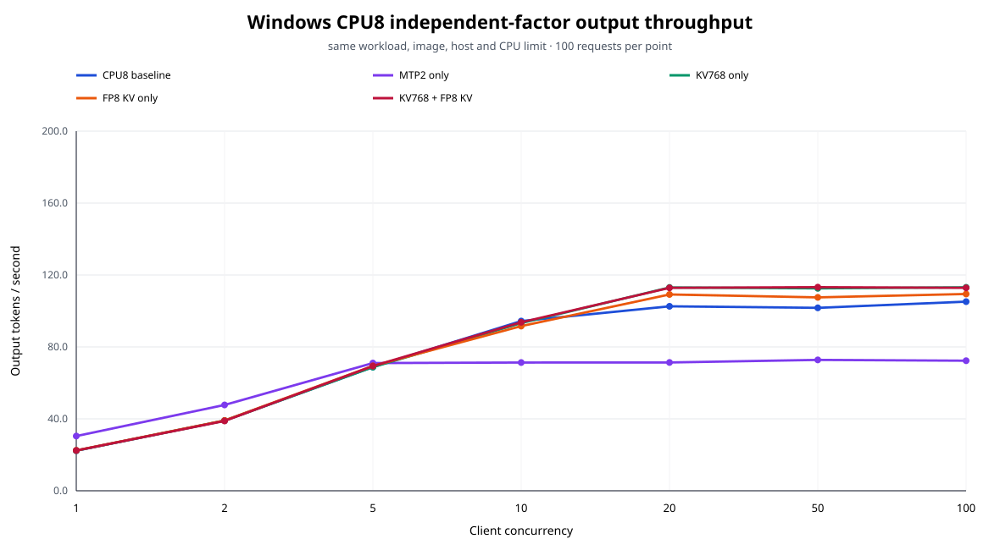
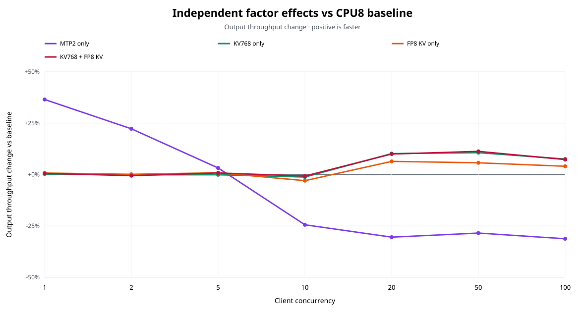
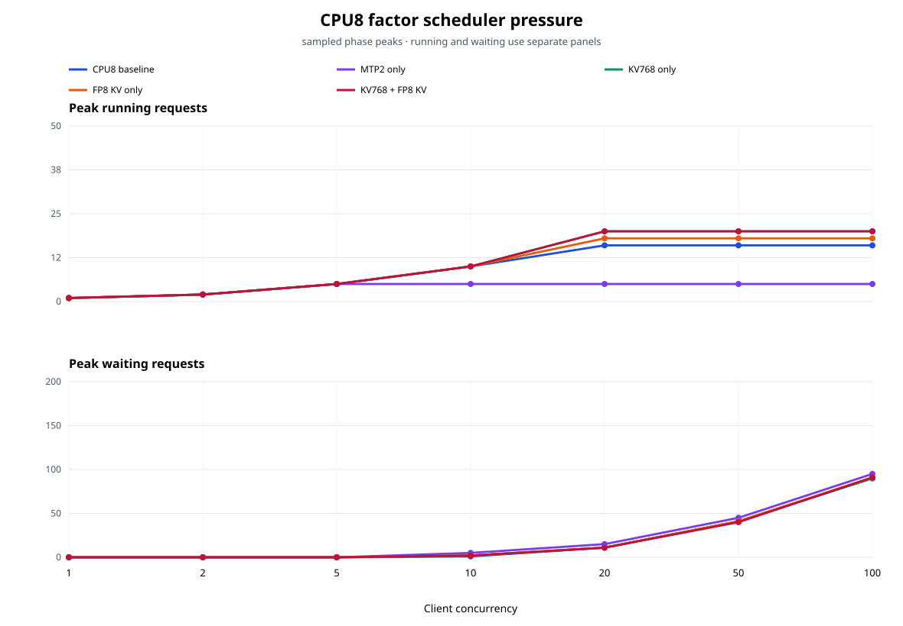

# Windows CPU8 독립 요인 실험

## 실험 목적

동일한 CPU8 baseline에서 MTP2, KV budget 768MiB, FP8 KV를 각각 하나씩만 적용해 독립 효과를 측정했다. 두 독립 요인이 모두 이득일 때 사용할 수 있는 KV768+FP8 KV 결합 구성은 결과가 존재하는 경우에만 추가 분석한다.

## 검증 결과

- 5개 구성 × 7개 concurrency × 100건 = `3,500/3,500` formal 요청 성공을 검증했다.
- core 4개 구성의 `2,800/2,800`은 필수이며, 결합 구성은 `포함되어 총 3,500건을 검증했다`.
- `summary.json`은 raw request, server/cgroup metric, phase artifact에서 다시 집계해 저장본과 일치함을 확인했다.
- host, Docker, Kubernetes node, immutable image, runner, Git 상태, 모델, workload, 입력 token 순서를 모든 구성에서 동일하게 대조했다.
- `suite-manifest.json`의 source fingerprint, runner hash, Docker fingerprint, Git commit과 invocation 이력을 formal manifest에 대조했다. 비교 시 suite 상태는 `completed`였다.
- 모든 formal phase의 restart, metric scrape error, runtime validation error, OOM, OOM-kill은 0이다.
- MTP draft/acceptance activity는 MTP-only 구성에서만 증가했고, 나머지 구성의 delta는 0으로 정규화해 확인했다.

## 실험 구성

| 구성 | CPU | MTP2 | KV budget | KV cache | baseline 대비 변수 |
|---|---:|---|---:|---|---|
| `baseline-cpu8` | 8 | off | 512MiB | BF16 | reference |
| `mtp-cpu8` | 8 | on | 512MiB | BF16 | MTP off→MTP2 |
| `baseline-kv768-cpu8` | 8 | off | 768MiB | BF16 | KV budget 512→768MiB |
| `baseline-cpu8-fp8` | 8 | off | 512MiB | FP8 KV | KV dtype BF16→FP8 |
| `baseline-kv768-fp8-cpu8` | 8 | off | 768MiB | FP8 KV | KV768 + FP8 |

## Output throughput

단위는 output tokens/second이다.

| C | CPU8 baseline | MTP2 only | KV768 only | FP8 KV only | KV768 + FP8 KV |
|---:|---:|---:|---:|---:|---:|
| 1 | 22.29 | 30.43 | 22.35 | 22.45 | 22.42 |
| 2 | 39.04 | 47.74 | 39.00 | 39.10 | 38.83 |
| 5 | 68.82 | 71.03 | 68.75 | 69.42 | 69.37 |
| 10 | 94.39 | 71.32 | 93.25 | 91.58 | 93.70 |
| 20 | 102.59 | 71.36 | 113.06 | 109.18 | 112.86 |
| 50 | 101.74 | 72.78 | 112.57 | 107.56 | 113.23 |
| 100 | 105.19 | 72.34 | 113.14 | 109.44 | 112.86 |

## 독립 요인 효과

각 값은 같은 concurrency의 공통 CPU8 baseline 대비 output throughput 변화율이다.

| C | MTP2 only vs baseline | KV768 only vs baseline | FP8 KV only vs baseline | KV768 + FP8 KV vs baseline |
|---:|---:|---:|---:|---:|
| 1 | +36.5% | +0.3% | +0.8% | +0.6% |
| 2 | +22.3% | -0.1% | +0.1% | -0.5% |
| 5 | +3.2% | -0.1% | +0.9% | +0.8% |
| 10 | -24.4% | -1.2% | -3.0% | -0.7% |
| 20 | -30.4% | +10.2% | +6.4% | +10.0% |
| 50 | -28.5% | +10.7% | +5.7% | +11.3% |
| 100 | -31.2% | +7.6% | +4.0% | +7.3% |

- **MTP2 only:** 7개 지점 중 3개에서 baseline보다 높았다. C1~C5 평균은 +20.7%, C10~C100 평균은 -28.6%이며, 범위는 C100 -31.2% ~ C1 +36.5%다.
- **KV768 only:** 7개 지점 중 4개에서 baseline보다 높았다. C1~C5 평균은 +0.0%, C10~C100 평균은 +6.8%이며, 범위는 C10 -1.2% ~ C50 +10.7%다.
- **FP8 KV only:** 7개 지점 중 6개에서 baseline보다 높았다. C1~C5 평균은 +0.6%, C10~C100 평균은 +3.3%이며, 범위는 C10 -3.0% ~ C20 +6.4%다.
- **KV768 + FP8 KV:** 7개 지점 중 5개에서 baseline보다 높았다. C1~C5 평균은 +0.3%, C10~C100 평균은 +7.0%이며, 범위는 C10 -0.7% ~ C50 +11.3%다.
- **결합 효과:** KV768과 FP8 KV의 독립 효과를 곱해 예측한 값 대비 결합 구성의 평균 interaction은 -2.2%p다.

## Scheduler pressure

표의 값은 `peak running / peak waiting`이다.

| C | CPU8 baseline | MTP2 only | KV768 only | FP8 KV only | KV768 + FP8 KV |
|---:|---:|---:|---:|---:|---:|
| 1 | 1/0 | 1/0 | 1/0 | 1/0 | 1/0 |
| 2 | 2/0 | 2/0 | 2/0 | 2/0 | 2/0 |
| 5 | 5/0 | 5/0 | 5/0 | 5/0 | 5/0 |
| 10 | 10/1 | 5/5 | 10/2 | 10/2 | 10/2 |
| 20 | 16/11 | 5/15 | 20/11 | 18/11 | 20/11 |
| 50 | 16/41 | 5/45 | 20/41 | 18/41 | 20/40 |
| 100 | 16/90 | 5/95 | 20/90 | 18/91 | 20/91 |

## MTP acceptance

| C | MTP acceptance |
|---:|---:|
| 1 | 76.0% |
| 2 | 75.8% |
| 5 | 75.8% |
| 10 | 76.0% |
| 20 | 76.0% |
| 50 | 76.0% |
| 100 | 75.7% |

## 기동 KV capacity

| 구성 | KV token capacity | max concurrency @ 2,048 tokens |
|---|---:|---:|
| CPU8 baseline | 19,894 | 9.71x |
| MTP2 only | 9,137 | 4.46x |
| KV768 only | 29,842 | 14.57x |
| FP8 KV only | 30,720 | 15.00x |
| KV768 + FP8 KV | 46,284 | 22.60x |

## 자원과 안정성

| 구성 | 최대 memory | 최대 avg CPU | 최대 throttled time | preemption 합계 | memory.max 합계 | OOM/OOM-kill |
|---|---:|---:|---:|---:|---:|---:|
| CPU8 baseline | 6.024GiB | 7.97 cores | 2.75% | 3 | 0 | 0/0 |
| MTP2 only | 8.000GiB | 7.97 cores | 3.33% | 0 | 0 | 0/0 |
| KV768 only | 7.504GiB | 7.98 cores | 1.94% | 0 | 0 | 0/0 |
| FP8 KV only | 6.273GiB | 7.99 cores | 2.13% | 0 | 0 | 0/0 |
| KV768 + FP8 KV | 6.510GiB | 7.98 cores | 2.97% | 0 | 0 | 0/0 |

- 모든 formal phase에서 `memory.events:max` delta는 0이었다.

## FP8 compatibility gate

- `baseline-cpu8-fp8`: C20 `20/20` 성공, output `93.21` tok/s, E2E p95 `13.562s`
- `baseline-kv768-fp8-cpu8`: C20 `20/20` 성공, output `112.44` tok/s, E2E p95 `11.249s`

게이트 요청은 formal 요청 수에 포함하지 않았다.

## 타당성 위협과 후속 실험

이번 결과는 같은 Windows 호스트에서 정해진 순서로 한 번씩 실행한 controlled screen이다. 실행 순서, 온도와 백그라운드 부하의 영향을 분리하려면 요인별 반복 측정과 순서 교차가 필요하다. 결합 효과는 단일 2-factor 조합만 확인하므로 전체 interaction을 설명하지 않는다. 후속 실험은 유효한 독립 요인만 대상으로 반복 횟수를 늘리고, 동시성 구간별 admission limit 및 replica scaling을 함께 평가해야 한다.

전체 phase 수치와 baseline 대비 효과는 [comparison.csv](comparison.csv), 기동 capacity는 [startup-capacity.csv](startup-capacity.csv)에 저장했다.
