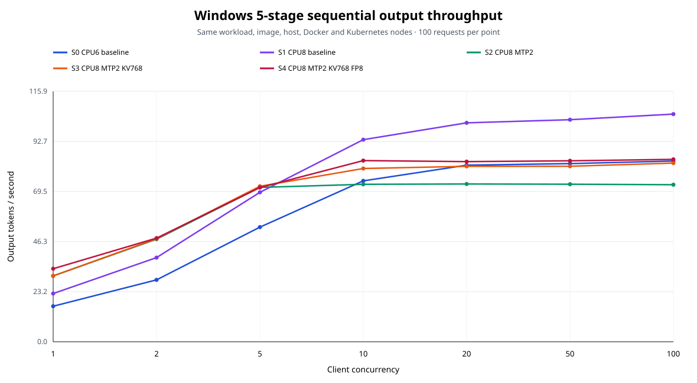

# Windows x86_64 5단계 순차 실험 비교

## 검증 결과

- 5개 stage × 7개 concurrency × 100건 = `3,500/3,500` 성공을 검증했다.
- `summary.json`을 raw request/metrics/phase artifact에서 다시 집계해 저장본과 일치함을 확인했다.
- workload config, prompt SHA-256, tokenized input, raw prompt/token/order, warmup, wall/monotonic timer를 전 단계에서 대조했다.
- 각 stage에서 같은 Pod UID/image ID/node가 7개 phase 동안 유지됐고 restart, metric scrape error, runtime validation error는 모두 `0`이다.
- Windows/x86_64 host, Docker identity/resources, amd64 node inventory, runner SHA-256, Git 상태, model/vLLM 및 immutable image ID가 전 단계에서 같다.
- container args와 CPU request/limit, memory request `4Gi`/limit `8Gi`를 stage별 기대값과 정확히 대조했다.
- OOM 및 OOM-kill delta는 모든 phase에서 반드시 `0`인 경우에만 이 보고서를 생성한다. `memory.events:max`는 OOM과 구분해 아래 감사 경고로 보존한다.

- 모든 phase의 `memory.events:max` delta가 `0`이다.

## 5단계 factor matrix

| Stage | CPU | MTP2 | KV budget | KV dtype | 직전 단계에서 바뀐 값 |
|---|---:|---|---:|---|---|
| `baseline` | 6 | off | 512MiB | auto (BF16) | reference |
| `baseline-cpu8` | 8 | off | 512MiB | auto (BF16) | CPU limit 6→8 |
| `mtp-cpu8` | 8 | on | 512MiB | auto (BF16) | MTP off→MTP2 |
| `mtp-kv768-cpu8` | 8 | on | 768MiB | auto (BF16) | KV budget 512→768MiB |
| `mtp-kv768-fp8-cpu8` | 8 | on | 768MiB | fp8 | KV dtype auto/BF16→FP8 |

S4의 FP8 args는 S3 args 뒤에 정확히 `--kv-cache-dtype fp8 --calculate-kv-scales`를 추가한다. 이는 KV-cache **FP8** 실험이며 INT8 weight quantization 실험이 아니다.

기동 로그는 모델 weight가 BF16인 상태에서 KV cache만 FP8임을 확인한다. Qwen3.5의 hybrid recurrent GDN 때문에 runtime KV scale 계산은 강제로 비활성화됐고 기본 scale `1.0`을 사용했다. 로그 자체도 적절한 scale이 없으면 정확도가 낮아질 수 있음을 경고한다. 따라서 S4의 기동, 별도 20-request gate 및 정식 700/700 성공은 serving 성능·안정성 증거이지 응답 품질 보증이 아니다.

별도 FP8 C20 gate는 raw artifact 재집계와 정식 S4의 runner/host/Docker/node/container/image 대조를 통과했다. 결과는 `20/20` 성공, output `76.97` tok/s, E2E p95 `16.247`s이며 정식 3,500건에는 포함하지 않는다.

## 기동 시 KV capacity

| Stage | KV budget | KV dtype | KV token capacity | max concurrency @ 2,048 tokens |
|---|---:|---|---:|---:|
| S0 | 512MiB | auto (BF16) | 19,894 | 9.71x |
| S1 | 512MiB | auto (BF16) | 19,894 | 9.71x |
| S2 | 512MiB | auto (BF16) | 9,137 | 4.46x |
| S3 | 768MiB | auto (BF16) | 13,705 | 6.69x |
| S4 | 768MiB | fp8 | 18,059 | 8.82x |

MTP2는 별도 drafter KV cache를 사용하므로 같은 512MiB에서도 S1의 19,894 tokens가 S2에서 9,137 tokens로 줄었다. 768MiB와 FP8은 이 capacity를 단계적으로 회복한다.

## Output throughput

단위는 output tokens/second이다.

| C | S0 | S1 | S2 | S3 | S4 |
|---:|---:|---:|---:|---:|---:|
| 1 | 16.44 | 22.31 | 30.48 | 30.45 | 33.79 |
| 2 | 28.63 | 38.93 | 47.45 | 47.69 | 47.95 |
| 5 | 53.03 | 69.14 | 71.41 | 71.95 | 71.35 |
| 10 | 74.44 | 93.50 | 72.85 | 80.16 | 83.82 |
| 20 | 81.70 | 101.29 | 72.99 | 81.16 | 83.35 |
| 50 | 82.42 | 102.73 | 72.89 | 81.19 | 83.72 |
| 100 | 83.63 | 105.33 | 72.66 | 82.67 | 84.39 |

## 인접 단계 효과

각 값은 같은 concurrency에서 직전 stage 대비 변화율이다. Throughput은 양수가 증가이며, E2E/TTFT/TPOT는 음수가 latency 개선을 뜻한다. 각 전이는 표에 적힌 factor 하나만 바뀌도록 검증됐다.

| 전이 | C | output tok/s | request rps | E2E p95 | TTFT p95 | TPOT p95 |
|---|---:|---:|---:|---:|---:|---:|
| S0→S1 (CPU limit 6→8) | 1 | +35.6% | +35.6% | -23.6% | -16.9% | -27.4% |
| S0→S1 (CPU limit 6→8) | 2 | +36.0% | +36.0% | -24.7% | -20.8% | -25.3% |
| S0→S1 (CPU limit 6→8) | 5 | +30.4% | +30.4% | -22.4% | -17.7% | -23.6% |
| S0→S1 (CPU limit 6→8) | 10 | +25.6% | +25.6% | -19.5% | -13.0% | -21.9% |
| S0→S1 (CPU limit 6→8) | 20 | +24.0% | +24.0% | -21.5% | -19.2% | -18.9% |
| S0→S1 (CPU limit 6→8) | 50 | +24.6% | +24.6% | -18.6% | -16.5% | -23.5% |
| S0→S1 (CPU limit 6→8) | 100 | +25.9% | +25.9% | -24.0% | -26.2% | -20.2% |
| S1→S2 (MTP off→MTP2) | 1 | +36.6% | +36.6% | -18.4% | +3.2% | -15.0% |
| S1→S2 (MTP off→MTP2) | 2 | +21.9% | +21.9% | -0.9% | +0.5% | -10.9% |
| S1→S2 (MTP off→MTP2) | 5 | +3.3% | +3.3% | +4.9% | -46.5% | +12.5% |
| S1→S2 (MTP off→MTP2) | 10 | -22.1% | -22.1% | +28.2% | +45.3% | -17.0% |
| S1→S2 (MTP off→MTP2) | 20 | -27.9% | -27.9% | +7.0% | +53.9% | -44.3% |
| S1→S2 (MTP off→MTP2) | 50 | -29.1% | -29.1% | +29.7% | +49.1% | -42.9% |
| S1→S2 (MTP off→MTP2) | 100 | -31.0% | -31.0% | +46.2% | +51.3% | -40.7% |
| S2→S3 (KV budget 512→768MiB) | 1 | -0.1% | -0.1% | -1.4% | +2.4% | +1.5% |
| S2→S3 (KV budget 512→768MiB) | 2 | +0.5% | +0.5% | -2.5% | -1.7% | +1.0% |
| S2→S3 (KV budget 512→768MiB) | 5 | +0.7% | +0.7% | -1.2% | -7.3% | +1.7% |
| S2→S3 (KV budget 512→768MiB) | 10 | +10.0% | +10.0% | -1.5% | -42.9% | +47.3% |
| S2→S3 (KV budget 512→768MiB) | 20 | +11.2% | +11.2% | -3.5% | -18.7% | +40.7% |
| S2→S3 (KV budget 512→768MiB) | 50 | +11.4% | +11.4% | -9.0% | -15.3% | +50.3% |
| S2→S3 (KV budget 512→768MiB) | 100 | +13.8% | +13.8% | -10.2% | -11.8% | +34.7% |
| S3→S4 (KV dtype auto/BF16→FP8) | 1 | +11.0% | +11.0% | -10.9% | +4.5% | -15.4% |
| S3→S4 (KV dtype auto/BF16→FP8) | 2 | +0.5% | +0.5% | -4.8% | +0.9% | -3.3% |
| S3→S4 (KV dtype auto/BF16→FP8) | 5 | -0.8% | -0.8% | -3.3% | +2.2% | -4.0% |
| S3→S4 (KV dtype auto/BF16→FP8) | 10 | +4.6% | +4.6% | -0.5% | -22.5% | +5.6% |
| S3→S4 (KV dtype auto/BF16→FP8) | 20 | +2.7% | +2.7% | -8.0% | -10.9% | +8.0% |
| S3→S4 (KV dtype auto/BF16→FP8) | 50 | +3.1% | +3.1% | -2.2% | -2.5% | +14.1% |
| S3→S4 (KV dtype auto/BF16→FP8) | 100 | +2.1% | +2.1% | -1.1% | -0.5% | +13.0% |

## 인접 단계의 exact response hash

| 전이 | C1 | C2 | C5 | C10 | C20 | C50 | C100 | 전체 |
|---|---:|---:|---:|---:|---:|---:|---:|---:|
| S0→S1 | 100/100 | 100/100 | 84/100 | 87/100 | 85/100 | 87/100 | 84/100 | 627/700 (89.6%) |
| S1→S2 | 82/100 | 74/100 | 72/100 | 74/100 | 71/100 | 70/100 | 72/100 | 515/700 (73.6%) |
| S2→S3 | 100/100 | 100/100 | 96/100 | 96/100 | 93/100 | 92/100 | 93/100 | 670/700 (95.7%) |
| S3→S4 | 15/100 | 30/100 | 35/100 | 33/100 | 36/100 | 33/100 | 33/100 | 215/700 (30.7%) |

이 표는 같은 prompt 위치의 `content_sha256` 완전 일치 수다. exact hash 차이는 문구 변화 신호일 뿐 정답률·의미 품질 지표가 아니다. 특히 S3→S4는 `215/700 (30.7%)`만 완전 일치하므로, scale `1.0` FP8을 production에 적용하기 전에 별도 task 품질 회귀 평가가 필요하다.

전체 절대값과 인접 reference 및 감사 지표는 [comparison.csv](comparison.csv), 응답 해시 원본은 [response-hash-comparison.csv](response-hash-comparison.csv), 기동 capacity는 [startup-capacity.csv](startup-capacity.csv)에 저장한다. 단일 순차 실행이므로 작은 차이는 반복 측정 없이 일반화하지 않는다.
