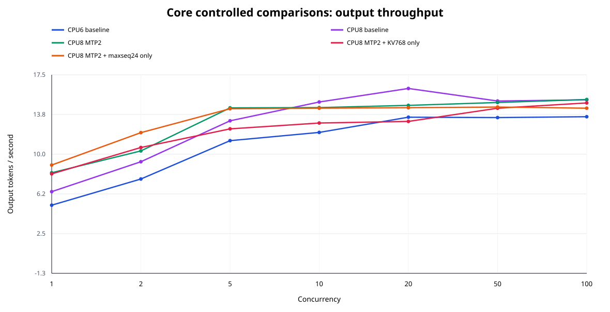
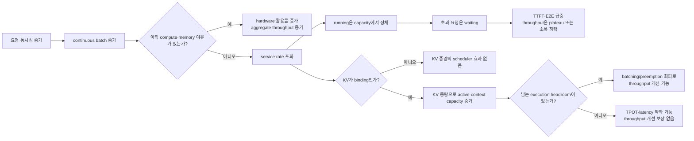
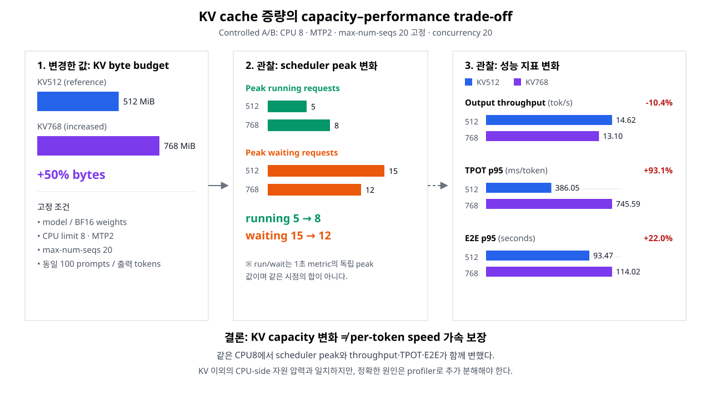

# 최종 종합 분석: 로컬 CPU vLLM 서빙과 최적화

## 1. 최종 결과 한눈에 보기

이 절만 읽어도 **환경, 가설, 실험, 결과, 병목 원인과 최종 선택**을 파악할 수 있다. 2절 이후는 파라미터, 원시 결과, 한계와 재현 절차를 보존한 상세 근거다.

### 1.1 Executive snapshot

| 항목 | 핵심 내용 |
|---|---|
| 환경 | Apple M4 MacBook Air, Docker Linux/ARM64 `10 vCPU·7.65GiB`, GPU 없는 CPU-only Kind 클러스터 |
| 모델·런타임 | 오픈웨이트 `Qwen/Qwen3.5-0.8B` BF16, vLLM `0.26.0+cpu` |
| 부하 | 공개 데이터셋 4종 각 25건, 총 100 prompts를 동시성 `1, 2, 5, 10, 20, 50, 100`에서 동일하게 실행 |
| 실험 규모 | 8개 설정 × 설정당 700건 = `5,600/5,600` 성공; client/server token counter 일치, scrape error·OOM kill 0 |
| 가장 명확한 개선 | CPU limit `6→8`: 모든 동시성에서 output throughput `+11.7~24.8%` |
| 최종 선택 | 지속적인 `C≥10`: `baseline-cpu8`; `C≤5` interactive 후보: `mtp-cpu8` |
| 미채택 | KV 768MiB는 수용량만 증가, `max-num-seqs=24`는 binding 증거 없음, FP8 KV는 ARM kernel 미지원 |

> **한 문장 결론:** MTP 설정은 낮은 동시성에서 유리했고 C=20에서도 TPOT·E2E는 개선했지만, active capacity와 queue가 달라져 100건 전체 완료 시간과 aggregate throughput을 항상 개선하지는 못했다. KV byte budget 증량은 더 많은 요청을 running으로 옮겼지만 per-token 연산을 직접 가속하지는 않았다.

### 1.2 무엇을 통제하고 비교했는가

동시성 `C`는 100건을 C번 반복한다는 뜻이 아니다. 동일한 100건 중 **최대 C건을 동시에 in-flight**로 유지하고, 완료된 자리에 다음 요청을 넣는다. 따라서 설정당 실측 요청은 `100×7=700건`이다.

| 검증 가설 | 직접 비교 | 고정한 변수 | 판정 질문 |
|---|---|---|---|
| CPU quota | CPU6 baseline → CPU8 baseline | 모델, MTP off, KV 512MiB, max-seqs 20 | 추가 CPU가 모든 부하에서 service rate를 높이는가 |
| MTP | CPU8 baseline → CPU8 MTP2 | CPU8, KV 512MiB, max-seqs 20 | speculative decode가 어느 동시성에서 순이득인가 |
| KV capacity | CPU8 MTP2 KV512 → KV768 | CPU8, MTP2, max-seqs 20 | 더 많은 active request가 처리량도 높이는가 |
| Scheduler ceiling | CPU8 MTP2 max-seqs20 → 24 | CPU8, MTP2, KV 512MiB | 기존 상한 20이 실제 병목인가 |
| FP8 KV startup pilot | BF16 KV → FP8 KV | 동일 ARM64 CPU 환경 | backend가 기동 가능한가 |

기존 `mtp-kv-tuned*`는 KV `512→768MiB`와 `max-num-seqs 20→24`를 동시에 변경한 **legacy capacity bundle**이다. 두 신규 분리 실험만 KV-only와 maxseq-only의 직접 통제 A/B 비교로 사용한다.

정식 `5,600건`은 8개 정상 기동 설정의 측정 요청이며 warmup은 제외한다. FP8은 API 기동 전에 실패한 별도 startup pilot이므로 여기에 포함하지 않았다.

### 1.3 핵심 처리량 결과



그래프는 CPU6 baseline에서 시작해 CPU8, CPU8+MTP2로 이어지는 controlled chain과, MTP2를 기준으로 KV-only·maxseq-only를 분리해 보여 준다. 모든 동시성의 정확한 수치와 각 열 머리글에 명시한 direct reference 대비 변화율은 [전체 비교표](../benchmark/results/comparison-all/REPORT.md)에 있다.

| 변경 | 핵심 실측 | 병목 진단 | 최종 판정 |
|---|---|---|---|
| CPU `6→8` | 모든 C에서 throughput `+11.7~24.8%`; 전체 phase 시간 `-16.5%` | CPU quota가 실제 service rate를 제한 | **채택**. 단, 알고리즘 최적화가 아닌 vertical scaling |
| MTP2 | C1/2/5 throughput `+27.8/+11.0/+9.3%`, C10/20 `-3.5/-9.9%` | C20에서 TPOT는 낮았지만 peak running `16→5`, waiting `9→15`로 queue trade-off 관찰 | **조건부 채택:** C≤5 후보 |
| KV `512→768MiB` | C20 run/wait `5/15→8/12`, throughput `-10.4%`, TPOT p95 `+93.1%` | active-context capacity는 증가했지만 KV 이외 CPU-side 자원 압력 가능성과 일치 | **속도 최적화로 미채택** |
| max-seqs `20→24` | sampled peak running/waiting 불변; C5~100 throughput `0.4~5.4%` 감소 | 상한 20이 binding됐다는 증거 없음 | **미채택**, 50 sweep도 후속으로 보류 |
| FP8 KV | API server 초기화 실패; 정식 5,600건 밖의 pilot | Apple ARM64 CPU용 FP8 KV kernel 없음 | 성능 결과가 아닌 **compatibility failure** |

Peak running과 peak waiting은 서로 다른 시점의 독립 최댓값이다. 설정당 단일 실행이고 CPU8 C=5의 두 유효 표본도 19.5% 차이가 있었으므로 작은 차이는 반복 검증 전까지 개선으로 확정하지 않는다.

### 1.4 동시성이 커질 때 실제로 무슨 일이 일어났는가

“C가 20을 넘으면 그때부터 같이 처리한다”는 해석은 정확하지 않다. vLLM continuous batching은 C>1부터 여러 요청을 함께 처리한다. 이번 데이터에서 중요한 지점은 **동시성 20이라는 숫자 자체가 아니라, 각 설정의 running capacity와 service 포화점**이다.

| CPU8 baseline | Output tok/s | Peak run/wait | Peak KV | E2E p95 |
|---:|---:|---:|---:|---:|
| C=1 | 6.44 | 1 / 0 | 7.5% | 15.61s |
| C=20 | **16.22** | 16 / 9 | 100% | 109.94s |
| C=100 | 15.15 | 16 / 91 | 100% | 415.57s |



즉, 이 실험에서 동시성을 높이면 CPU8 baseline의 aggregate throughput은 C1 `6.44`에서 C20 `16.22 tok/s`까지 증가했다. 병목 이후에는 C50/100에서도 약 `15 tok/s`로 **포화**됐고, C1/C20/C50/C100 E2E p95는 각각 `15.61/109.94/230.02/415.57초`로 급증했다. “처리량이 계속 크게 떨어졌다”기보다 **총 처리량은 더 늘지 않고 사용자 대기시간이 폭증했다**가 정확한 설명이다.

### 1.5 가정이 틀린 이유

| 처음 가정 | 실제로 개선되는 조건 | 이번 실측이 보여 준 것 |
|---|---|---|
| MTP면 모든 구간이 빨라진다 | accepted token으로 절약한 target step 비용이 draft·verification·capacity 비용보다 커야 함 | C20 acceptance 75.8%, TPOT·E2E는 낮았지만 run/wait `16/9→5/15`, TTFT `+41.6%`, throughput `-9.9%` |
| KV byte budget을 늘리면 모두 빨라진다 | KV가 binding이고, 늘어난 active batch를 처리할 execution headroom이 있어야 함 | MTP C20 run/wait `5/15→8/12`로 capacity는 개선됐지만 TPOT `+93.1%`, E2E `+22.0%`, throughput `-10.4%` |
| max-seqs를 높이면 동시 처리가 늘어난다 | 실제 running이 기존 상한에 도달해야 함 | 1초 sampled peak가 기준과 같아 상한 20이 binding됐다는 증거가 없음 |



이 그림은 CPU8·MTP2·`max-num-seqs=20`을 고정한 C=20 직접 비교를 시각화한다. **KV 증량은 active-context 수용량 조정이지 per-token CPU 연산 가속과 동의어가 아니며**, 정확한 CPU-side 악화 원인은 profiler 없이 더 세분하지 않는다.

MTP의 TPOT와 active-batch 조건이 함께 달라졌으므로 intrinsic MTP 효과를 분리할 수 없다. KV 증량 뒤의 정확한 CPU-side 제약도 compute/cache/memory/threading으로 분해하지 못했다. 일반 비용 구조는 [Speculative Decoding 원 논문](https://proceedings.mlr.press/v202/leviathan23a.html), KV capacity와 preemption 관계는 [vLLM 최적화 문서](https://docs.vllm.ai/en/v0.26.0/configuration/optimization/)와 [PagedAttention 논문](https://arxiv.org/abs/2309.06180)에 근거한다. 상세 수치와 한계는 9~12절에 보존했다.

`max-num-seqs=50`은 KV를 늘리고 실제 running이 20에 도달하는 조건을 만든 뒤 `8/12/16/20/24/50`으로 sweep한다.

### 1.6 GPU를 사용해도 같은가

**원리는 같지만 결과 숫자와 최적점은 같지 않다.** GPU도 지속 가능한 service rate, KV capacity 또는 scheduler budget을 넘으면 running은 포화되고 초과 요청은 waiting에 쌓여 TTFT/E2E가 급증한다. GPU라고 queueing이 사라지거나 MTP·KV 증량이 전 구간 개선을 보장하지 않는다.

| 관점 | 이번 Apple M4 CPU | GPU production |
|---|---|---|
| 공통 원리 | continuous batching → 포화 → waiting 증가 | 동일 |
| 주된 자원 | 제한된 core quota, CPU cache·DRAM, thread binding | decode의 HBM bandwidth, prefill의 compute, GPU memory·kernel shape |
| 큰 batch | core/cache 경쟁으로 빨리 손해가 날 수 있음 | 초기에는 parallel utilization이 좋아져 더 큰 이득이 날 수 있지만 결국 포화 |
| KV 증량 | active slot은 늘었지만 CPU-side pressure 가능성 | KV가 병목이고 GPU에 headroom이 있으면 throughput 개선 가능; 아니면 latency가 악화되고 throughput도 개선되지 않거나 낮아질 수 있음 |
| MTP | 저동시성 이득, 고동시성 추가 work·capacity trade-off | 동일 trade-off가 존재하나 acceptance, kernel, batch shape에 따라 crossover가 달라짐 |
| FP8 KV | ARM CPU kernel 미지원으로 startup 실패 | 지원 GPU backend에서 capacity와 품질을 다시 검증 |
| 필요한 조치 | `baseline-cpu8` 기본, MTP2는 저동시성 조건부 | GPU별로 MTP depth, KV dtype/size, max-seqs, batched tokens를 다시 A/B 측정 |

따라서 이 로컬 결과에서 GPU로 그대로 가져갈 것은 **지표와 실험 방법**이다. `output tok/s`만 보지 말고 `TTFT·TPOT·running·waiting·KV usage·preemption`을 함께 보고, GPU에서는 최적값을 다시 찾아야 한다.

이 결론은 이 장비, 모델, 고정 workload와 설정당 단일 반복에 한정된다. 전체 CPU 최적화 공간의 전역 최적값이나 GPU production의 최적 설정을 증명하지 않는다.

## 2. 상세 근거: 환경과 CPU-only 검증

| 항목 | 실측·고정값 |
|---|---|
| Host | Apple M4 MacBook Air, logical CPU 10, unified memory 16GB |
| Docker Desktop VM | Linux/ARM64, 10 vCPU, 약 7.65GiB RAM |
| Docker / Kind / Kubernetes | Docker Engine 28.0.4 / Kind v0.32.0 / Kubernetes v1.32.11 |
| kubectl | v1.32.2 |
| Cluster | `project-process`, control-plane 1 + worker 1 |
| Runtime | vLLM `0.26.0+cpu`, `device_config=cpu` |
| GPU·Metal·cloud | 사용하지 않음; Kubernetes GPU resource 요청도 없음 |
| Service | `llm-serving/vllm-cpu`, ClusterIP port 8000 |

동일한 image를 control-plane과 worker의 containerd에 로드하고, Linux/ARM64 및 worker role `nodeSelector`로 추론 Pod를 worker에만 배치했다. 애플리케이션 image 이름에 master/worker를 넣지 않는다. CPU8의 cgroup `cpu.max=800000 100000`은 100ms period당 최대 800ms CPU time임을 확인한다. 최초 과제 단계의 환경·빌드·배포 증거는 [컨테이너·클러스터 리포트](01_CONTAINER_CLUSTER_DEPLOYMENT.md), [build metadata](../results/build-metadata.txt), [cluster metadata](../results/cluster-metadata.txt), [deployment metadata](../results/deployment-metadata.txt)에 보존했다. 모든 실험 후에는 image를 다시 빌드해 두 노드에 로드하고 `baseline-cpu8`로 복구했으며, 현재 image ID·args·CPU-only·smoke 결과는 [final-state metadata](../results/final-state-metadata.txt)에 별도로 기록했다. 정식 8개 run의 captured container image ID는 모두 `53e0d7…`로 같고, 최종 rebuild는 Docker 단독 실행의 CMD에도 이미 K8s가 명시하던 KV 512MiB 인자를 추가해 config ID가 `4d3369…`로 바뀌었다. K8s의 명시적 container args와 실행 파라미터는 변하지 않았다.

Docker VM 메모리가 물리 RAM보다 작고 한 Pod가 최대 6GiB 이상을 사용하므로 control-plane 1개와 worker 1개, replica 1로 제한했다. 이 때문에 optional HPA scale-out과 worker 장애 후 다른 worker로의 재스케줄은 현재 환경에서 의미 있게 검증하지 않았다.

## 3. 모델·런타임·컨테이너 선택 근거

최종 모델은 `Qwen/Qwen3.5-0.8B`, revision `2fc06364715b967f1860aea9cf38778875588b17`이다.

| 선택 기준 | 근거 |
|---|---|
| CPU 실행 가능성 | 0.8B, 약 1.63GiB BF16 checkpoint로 7.65GiB Docker VM 안에 weight·runtime·KV를 함께 수용 가능 |
| 오픈웨이트 | 공식 Qwen repository, Apache-2.0 |
| 최적화 비교 | checkpoint에 native MTP layer 1개가 있어 같은 target model에서 MTP off/on 비교 가능 |
| 재현성 | model revision과 vLLM base image digest를 고정하고 weight를 image에 포함 |
| 텍스트 과제 | `--language-model-only`로 불필요한 vision 입력 경로 비활성화 |

더 작은 Qwen2.5-0.5B도 검토했지만 native MTP head가 없어 과제의 speculative decoding 비교를 수행할 수 없었다. Qwen3.5-0.8B를 선택함으로써 모델·weight·정밀도를 유지하고 runtime 설정의 차이를 비교했다.

컨테이너는 공식 ARM64 CPU image `vllm/vllm-openai-cpu:v0.26.0-arm64`를 digest `sha256:5966fcc14fe241ee7f2dc3d3fd5610ed12968eb9c0d096e1089802b79681efc4`로 고정했다. 모델을 image의 `/models/qwen3.5-0.8b`에 포함하고 Hugging Face/Transformers offline mode를 사용해 Pod 시작 시간과 외부 네트워크 상태를 분리했다. image 정의는 [Dockerfile](../model_serving/Dockerfile), 실제 배포는 [Deployment](../model_serving/k8s/base/deployment.yaml)에 있다.

## 4. 명시한 파라미터와 기본값으로 둔 항목

### 4.1 Server·scheduler 명시값

| 파라미터 | 값 | 선정 이유 |
|---|---|---|
| Model / served name | `/models/qwen3.5-0.8b` / `qwen3.5-0.8b` | offline 고정 checkpoint와 API identity 분리 |
| Host / port | `0.0.0.0:8000` | ClusterIP Service 연결 |
| `--dtype` | `bfloat16` | checkpoint 정밀도를 유지하면서 현재 메모리에 수용 |
| `--language-model-only` | on | text-only workload에 vision 경로 제외 |
| `--max-model-len` | 2,048 | 제한된 KV·RAM에서 모든 고정 prompt와 64 output tokens 수용 |
| `--max-num-seqs` | baseline 20 | 한 iteration의 sequence 상한을 고정 |
| `--max-num-batched-tokens` | 2,048 | prefill batch budget을 실험 간 고정 |
| `--kv-cache-memory-bytes` | baseline/MTP 536,870,912(512MiB) | 초기 1GiB KV에서 부족했던 memory headroom 확보 |
| Prefix caching | `--no-enable-prefix-caching` | 동일 system prompt와 반복 phase의 cross-request warm-cache 편향 제거 |
| MTP | baseline off; MTP는 `qwen3_next_mtp`, 2 speculative tokens | 같은 checkpoint의 native proposer 사용 |
| Capacity bundle | KV 805,306,368(768MiB) + `max-num-seqs=24` | MTP의 active capacity와 queue trade-off 탐색; 두 변수 결합 실험 |

`qwen3_next_mtp`는 당시 실제 manifest에 사용한 vLLM 0.26 alias이며 내부적으로 generic `mtp`로 정규화된다. 모델에는 native MTP layer가 1개라 speculative token 2도 같은 layer를 반복 사용할 수 있다. 재현 기록은 바꾸지 않되 다음 실험은 `method=mtp`, token 1과 2를 독립 비교한다.

일반 autoregressive KV cache는 요청 안에서 과거 K/V 재계산을 피하는 필수 상태이므로 끄지 않았다. 요청 간 prefix block을 재사용하는 Automatic Prefix Caching만 껐다. 요청이 완료되면 해당 KV block은 allocator로 반환되며, 실제 prefix cache query/hit 증가량도 0인지 확인했다.

### 4.2 Kubernetes·client 명시값

| 영역 | 값 |
|---|---|
| Pod CPU request | 4 cores |
| CPU limit | baseline 6, 단일 변경 및 CPU8 실험 8 cores |
| Pod memory request/limit | 4Gi / 6656Mi(6.5GiB) |
| Replica / rollout | 1 / `Recreate` |
| `/dev/shm` | memory-backed 512MiB |
| Probes | `/health` startup/readiness/liveness |
| Image policy | `Never`; Kind에 import한 고정 image만 사용 |
| API | streaming `/v1/chat/completions`, usage 포함 |
| Output | 요청당 64 tokens, `ignore_eos=true` |
| Sampling | `temperature=0`, seed `20260828` |
| Warmup / cooldown | phase별 3건·8 output tokens, 통계 제외 / idle 후 3초 |
| Metric interval / timeout | 1초 / 요청당 1,200초 |

CPU8은 Docker VM의 10 vCPU를 전부 Pod에 주지 않고 8만 허용해 control-plane, kubelet, container runtime과 benchmark client의 여유를 남겼다.

### 4.3 런타임 기본값으로 남긴 항목

- Tensor/pipeline/data parallel 플래그를 명시하지 않았고 replica 1, 단일 모델 engine으로 실행했다. 분산 parallelism은 이번 로컬 CPU 실험 범위가 아니다.
- `--kv-cache-dtype`을 정상 설정에서 명시하지 않아 모델 dtype을 따르는 BF16 KV 경로를 사용했다. FP8 후보에서만 이를 명시적으로 바꿨다.
- OpenMP thread 수와 affinity를 환경변수로 고정하지 않고 vLLM auto binding을 사용했다. CPU8 Pod에서는 visible CPU 10개를 기준으로 inference thread 9개와 reserved core 1개가 관찰돼 8-core quota보다 thread가 하나 많다.
- `--enforce-eager`를 사용하지 않았고 CPU runtime의 기본 compilation 경로를 유지했다. Eager/compile은 독립 A/B가 아니므로 성능 원인으로 단정하지 않는다.
- Chunked prefill, block size 등 명시하지 않은 scheduler 세부값은 고정 vLLM version의 기본값을 사용했다. 향후 비교에서는 효과를 주장하기 전에 한 번에 하나씩 명시해야 한다.

## 5. 공개 데이터셋 workload와 재현성

### 5.1 실제 source와 선택 방법

| Source | 원본 pool | 선택 | Prompt 구성 |
|---|---:|---:|---|
| GSM8K test | 1,319 | 25 | question에 수학 추론 지시문 추가 |
| HumanEval | 164 | 25 | 함수 prompt에 코드 완성 지시문 추가; 생성 코드는 실행하지 않음 |
| TruthfulQA | 790 | 25 | Question에 간결하고 사실적인 답변 지시문 추가 |
| LongBench Qasper | 200 | 25 | 논문 context와 input question 결합 |

고정 seed `20260828`에 source별 offset 0/1000/2000/3000을 더해 비복원 `random.sample`로 각각 25건을 선택했다. 선택 후 `GSM8K→HumanEval→TruthfulQA→Qasper` 순서로 한 건씩 interleave해 매 phase에 동일한 balanced order를 사용했다. 정답률·perplexity·코드 실행을 평가하지 않으며, 공개 데이터는 서로 다른 입력 형태와 길이를 만드는 serving workload로만 사용한다. 생성 과정은 [prepare_dataset.py](../benchmark/scripts/prepare_dataset.py), 원본 metadata는 [source-manifest.json](../benchmark/data/source-manifest.json), 실제 입력은 [prompts.jsonl](../benchmark/data/prompts.jsonl)에 있다.

Qasper context는 선택 순서에 따라 `1,800 / 2,400 / 3,000 / 3,600 / 4,200`자 budget을 순환해 각 길이를 5건씩 만든다. 이는 token bucket이 아니라 문자 단위 절단이며 문장 중간이 잘릴 수 있다. 실행 전 `/tokenize`로 system+user+chat template 전체 길이를 다시 검사해 input + output이 2,048을 넘는 요청을 거부한다.

### 5.2 실측 prompt 길이

`prompt_chars`는 사용자 prompt만, input tokens는 `/tokenize`가 센 system prompt·user prompt·chat template 전체를 뜻한다.

| Source | 문자 min / mean / max | Input token min / mean / max | Token 합 | 전체 input 비중 |
|---|---:|---:|---:|---:|
| TruthfulQA | 148 / 188.20 / 403 | 105 / 112.96 / 156 | 2,824 | 9.48% |
| GSM8K | 204 / 386.04 / 700 | 121 / 162.64 / 227 | 4,066 | 13.65% |
| HumanEval | 221 / 480.72 / 884 | 158 / 214.68 / 303 | 5,367 | 18.02% |
| Qasper | 1,940 / 3,156.60 / 4,374 | 422 / 701.36 / 1,049 | 17,534 | 58.86% |
| 전체 | 148 / 1,052.89 / 4,374 | 105 / 297.91 / 1,049 | 29,791 | 100% |

전체 input-token 중앙값은 175, p95는 866.2다. 코드에는 token bucket 필드가 없으므로 다음 표는 보고서용으로 동일한 실측 count를 powers-of-two 구간에 파생 집계한 것이다.

| Input token 구간 | 요청 수 |
|---|---:|
| ≤128 | 23 |
| 129–256 | 48 |
| 257–512 | 9 |
| 513–1,024 | 19 |
| >1,024 | 1 |

길이 다양성은 있지만 71%가 256 tokens 이하이고 최대 input도 1,049이므로 2,048 context 경계의 장문 capacity는 검증하지 않는다. 요청 수는 source별 동일해도 Qasper가 전체 input tokens의 58.86%를 차지하므로 source별 계산량은 균등하지 않다.

### 5.3 Hash

- `prompts.jsonl` 파일 SHA-256: `ce76ecbeb5810392ff94473c13ed98f54d56e3c32c9343bb187ef63f0db2bebc`
- prompt hash 순서를 결합한 workload SHA-256: `576df81caa41863089adbbe111e083a540291c18fe8f313e9867041f01f3b2aa`
- 개별 `prompt_sha256`: 100개 모두 고유
- GSM8K 원본: `3730d312f6e3440559ace48831e51066acaca737f6eabec99bccb9e4b3c39d14`
- HumanEval 원본: `b796127e635a67f93fb35c04f4cb03cf06f38c8072ee7cee8833d7bee06979ef`
- TruthfulQA 원본: `b8d8ef1e12f98b4f2a9f47abc9765da0640b182b6c5d9b92f0c1a1f2f1e02e5c`
- LongBench archive: `cb45b11a4133c6bc1d6a44b0f8e701335ff1e543195db1103472e575857f7f64`

모든 정식 run manifest가 동일한 prompt 파일 hash와 input min/mean/max `105 / 297.91 / 1,049`를 기록한다. 다만 dataset cache가 존재하면 생성 스크립트는 non-empty 여부만 확인하고 재사용하므로 raw hash allow-list를 실행 전에 강제하는 방식보다 약하다. 고정 revision URL, source manifest, committed workload와 run manifest를 함께 보존해 이 한계를 보완한다.

## 6. 부하 발생의 정확한 의미

동시성 C는 요청 100건을 C번 반복한다는 뜻이 아니다. 같은 100건 중 최대 C건만 동시에 HTTP in-flight가 되도록 `ThreadPoolExecutor(max_workers=C)`가 closed-loop로 처리한다. 한 요청이 끝나면 client worker가 다음 요청을 시작한다.

- C=1: 동일 100건을 최대 1건씩 순차 처리
- C=2·5·10·20·50: 최대 C건 in-flight, 나머지는 client executor에서 차례를 기다림
- C=100: 고정 100건 전체가 거의 동시에 in-flight
- 설정당 정식 요청: `100×7=700건`
- 설정당 warmup: `3×7=21건`; 통계 제외

각 phase의 총 input은 29,791 tokens, output은 6,400 tokens로 같다. 따라서 동시성만 바뀌고 총 작업량과 prompt 순서는 유지된다. 이 설계는 before/after A/B에 유리하지만 고정 arrival rate나 Poisson traffic을 재현하는 open-loop 부하는 아니다.

Warmup은 interleave된 첫 세 prompt만 사용해 GSM8K·HumanEval·TruthfulQA를 포함하지만 Qasper 장문은 포함하지 않는다. C>3의 높은 동시성도 warmup에서 재현하지 않으므로 장문 prefill과 high-concurrency cold path가 남을 수 있다.

`ignore_eos=true`는 모든 성공 요청이 64 output tokens를 생성하게 해 조기 EOS의 작업량 차이를 제거한다. 반면 실제 사용자의 자연스러운 output 길이와 품질 분포를 희생한 synthetic workload다. 스트리밍을 사용해 first content 도착 시점을 측정하며 응답 본문 hash는 저장하지만 품질을 채점하지 않는다.

## 7. 지표 선정 이유와 한계

| 관점 | 지표 | 선택 이유 | 한계 |
|---|---|---|---|
| 정확성 | success, client/server token 합 | 누락·실패를 빠른 요청으로 잘못 집계하지 않음 | metric scrape와 API usage가 정상이라는 전제 필요 |
| 사용자 체감 | E2E p50/p95/p99 | 요청 시작부터 SSE 종료까지 전체 대기 | local port-forward, HTTP와 client overhead 포함; 100건 p99는 불안정 |
| 첫 응답 | TTFT p50/p95/p99 | queue·prefill이 첫 응답에 미치는 영향 | 첫 non-empty content chunk 기준이며 queue와 prefill을 직접 분해하지 못함 |
| Decode | TPOT p50/p95/p99 | 첫 token 후 active batch의 생성 속도 | `(E2E-TTFT)/(completion_tokens-1)` 근사이며 실제 inter-token 분포가 아님 |
| Capacity | request/s, prompt/output token/s | 고정 시간에 완료한 요청·token 양 | closed-loop와 인공적인 source mix에 한정 |
| Scheduler | running, waiting, preemption | 실행 폭, server queue와 재계산 확인 | 1초 sampling이 짧은 peak를 놓칠 수 있음 |
| KV | peak usage와 기동 token capacity | cache pressure와 waiting 연결 | 사용률은 cache 총량이 다른 설정끼리 절대 비교할 수 없음 |
| MTP | draft/accepted tokens, acceptance | speculative proposal의 유효 비율 확인 | acceptance만으로 verification 비용과 전체 성능을 설명할 수 없음 |
| CPU | cgroup usage, throttled period/time | quota 포화와 oversubscription 확인 | host background load, thermal, memory bandwidth는 측정하지 않음 |
| RAM·안전성 | `memory.current`, memory events, OOM/restart | memory headroom과 실패 여부 확인 | 1초 표본 peak이며 weight/KV/allocator를 분해하지 못함 |
| APC 통제 | prefix query/hit counter | cross-request cache가 결과에 섞이지 않았는지 확인 | 실제 warm-prefix production workload 성능은 보여 주지 않음 |

E2E, TTFT, TPOT의 p95는 서로 다른 요청이 percentile 위치를 차지할 수 있으므로 서로 더하지 않는다. Peak running과 peak waiting도 각 시계열의 독립적인 최댓값이므로 같은 시점의 한 쌍으로 합산하지 않는다. vLLM process metric이 API process만 나타낼 수 있어 CPU와 RAM은 컨테이너 cgroup을 함께 수집한다.

## 8. 데이터 유효성

- 정식 8개 설정은 설정당 700건, 총 `5,600/5,600` 성공
- 모든 정식 phase에서 client prompt/completion token 합 `29,791/6,400`과 server counter 증가량 일치
- Formal run의 prompt SHA-256, model endpoint, image, args, resources와 benchmark config 보존
- 종합 비교기는 8개 `summary.json`을 raw request/metric에서 다시 집계해 stale summary를 거부하고, 시작 snapshot의 Pod image ID가 모두 같은지 검증
- Prefix cache hit 0, OOM kill 0; 각 run 시작 manifest의 Pod restart count 0
- CPU6 baseline C=2와 CPU8 baseline C=10의 초기 표본은 host suspension으로 UTC wall clock과 monotonic timer가 각각 5,365.15초, 8,169.92초 벌어져 제외 후 재측정
- 제외한 request/metric/phase 자료와 이유를 [baseline/excluded](../benchmark/results/baseline/excluded/) 및 [baseline-cpu8/excluded](../benchmark/results/baseline-cpu8/excluded/)에 보존
- CPU8 C=5 첫 표본은 timer와 metric이 유효하지만 사용자 요청으로 한 번 더 측정했으며 두 표본의 throughput 차이는 19.5%

따라서 실패·중단 표본을 숨기지 않았지만, 유효한 C=5 두 표본 중 최신값을 공식 비교에 사용한 선택 효과와 단일 반복의 변동은 남는다.

## 9. 기존 실측 결과

### 9.1 설정 행렬

| 결과 ID | CPU limit | MTP | KV | `max-num-seqs` | 분류 |
|---|---:|---|---:|---:|---|
| `baseline` | 6 | off | 512MiB | 20 | CPU6 baseline |
| `mtp` | 6 | MTP2 | 512MiB | 20 | CPU6 MTP-only |
| `mtp-kv-tuned` | 6 | MTP2 | 768MiB | 24 | Legacy capacity bundle |
| `baseline-cpu8` | 8 | off | 512MiB | 20 | CPU8 baseline; CPU limit 단일 변경 |
| `mtp-cpu8` | 8 | MTP2 | 512MiB | 20 | CPU8 MTP-only |
| `mtp-kv768-cpu8` | 8 | MTP2 | 768MiB | 20 | KV byte budget 단독 변경 |
| `mtp-seq24-cpu8` | 8 | MTP2 | 512MiB | 24 | `max-num-seqs` 단독 변경 |
| `mtp-kv-tuned-cpu8` | 8 | MTP2 | 768MiB | 24 | Legacy capacity bundle |

`mtp-kv-tuned*`라는 ID는 Make target·결과 경로 재현성을 위해 유지한다. 해석과 사용자 표시에서는 KV-only가 아니라 capacity bundle로 부른다. 전체 인과성 행렬은 [최적화 실험 매트릭스](../optimization/EXPERIMENT_MATRIX.md)에 있다.

### 9.2 Output throughput

단위는 output token/s다.

| C | CPU6 base | CPU6 MTP2 | CPU6 bundle | CPU8 base | CPU8 MTP2 | CPU8 bundle |
|---:|---:|---:|---:|---:|---:|---:|
| 1 | 5.16 | 7.80 | 7.43 | 6.44 | 8.24 | 9.33 |
| 2 | 7.64 | 9.99 | 10.01 | 9.28 | 10.30 | 12.10 |
| 5 | 11.28 | 11.87 | 11.40 | 13.16¹ | 14.38 | 14.35 |
| 10 | 12.06 | 11.81 | 11.51 | 14.94 | 14.41 | 14.83 |
| 20 | 13.50 | 11.78 | 11.84 | 16.22 | 14.62 | 14.75 |
| 50 | 13.46 | 12.31 | 12.52 | 15.03 | 14.89 | 14.33 |
| 100 | 13.54 | 12.05 | 12.29 | 15.15 | 15.18 | 13.66 |

¹ CPU8 C=5는 두 번째 유효 표본을 공식값으로 사용했다. 첫 유효 표본은 11.01 token/s였고 원자료를 보존했다.

원본 표와 그래프는 [CPU6 비교](../benchmark/results/comparison/), [CPU6 분석](04_OPTIMIZATION_FINAL_ANALYSIS.md), [CPU8 baseline 비교](../benchmark/results/comparison-cpu8/), [CPU8 CPU-limit 분석](05_BASELINE_CPU8_ANALYSIS.md), [CPU8 MTP·bundle 비교](../benchmark/results/comparison-cpu8-optimizations/), [CPU8 최적화 분석](06_CPU8_MTP_KV_ANALYSIS.md)에 있다.

### 9.3 CPU limit 6→8 단일 변경

| C | Output tok/s 6→8 | 변화 | E2E p95 변화 | TTFT p95 변화 | TPOT p95 변화 |
|---:|---:|---:|---:|---:|---:|
| 1 | 5.16→6.44 | +24.8% | -17.8% | -16.2% | -20.6% |
| 2 | 7.64→9.28 | +21.4% | -16.9% | -19.4% | -22.4% |
| 5 | 11.28→13.16 | +16.7% | -11.8% | -8.0% | -16.0% |
| 10 | 12.06→14.94 | +23.9% | -19.3% | -21.6% | -19.3% |
| 20 | 13.50→16.22 | +20.2% | -16.2% | -22.6% | -0.9% |
| 50 | 13.46→15.03 | +11.7% | -9.6% | -11.7% | -3.3% |
| 100 | 13.54→15.15 | +11.8% | -10.4% | -8.8% | -17.5% |

CPU6은 phase 평균 CPU의 평균 5.65 cores, CPU8은 7.11 cores를 사용해 추가 quota가 실제 연산으로 이어졌다. C=20에서 CPU8 throughput이 16.22 token/s로 최고였고 C=50·100에서는 15.03·15.15로 더 늘지 않았다. CPU를 늘려 service rate는 개선됐지만 peak running 16과 KV 100%는 그대로여서 고동시성 queue 병목은 해소되지 않았다.

### 9.4 MTP 효과

MTP2의 정식 speculative acceptance는 대체로 `75~77%`였다. CPU6에서 MTP는 C=1·2 throughput을 baseline보다 `51.1%`, `30.7%` 높였지만 C≥20에서는 `8.6~12.7%` 낮았다. CPU8에서도 C=1·2·5는 `27.8%`, `11.0%`, `9.3%` 높고 C=10·20은 `3.5%`, `9.9%` 낮았다.

낮은 동시성에서는 MTP 설정의 throughput이 baseline보다 높았다. 고동시성에서는 같은 512MiB에서 기동 KV capacity가 baseline 19,894 tokens에서 MTP 9,137 tokens로 줄고 peak running이 5에 머물며 waiting이 늘었다. TPOT와 active-batch 조건이 함께 달라져 accepted proposal의 이득과 draft/verification 비용을 component 단위로 분리할 수 없으며, 낮은 TPOT가 전체 요청의 TTFT와 총 throughput 개선을 보장하지 않았다.

Generic MTP 5-token pilot도 기동했지만 모델의 MTP layer가 1개인 상태에서 같은 layer를 반복 forward했다. Acceptance가 약 48%, C=20 throughput이 9.01 token/s로 MTP2보다 낮아 정식 700건 후보에서 제외했다.

### 9.5 Legacy capacity bundle 효과와 한계

Bundle은 MTP2에 KV `768MiB`와 `max-num-seqs=24`를 함께 적용했다. 기동 KV capacity는 13,705 tokens, peak running 최대값은 8로 늘고 MTP-only보다 peak waiting 최대값이 3개 줄었다. 그러나 CPU8에서 C=50·100 throughput은 MTP-only보다 3.7%, 10.0% 낮고 C=100 E2E p95는 `415.08→463.65초`로 11.7% 늘었다. 실행 폭만 늘리고 CPU quota는 그대로인 조건에서 active batch의 CPU/cache/memory-bandwidth 경쟁이 커졌다는 해석과 일치한다.

MTP-only와 bundle 모두 peak running 5·8로 기존 `max-num-seqs=20`보다 작았다. KV budget이 실행 폭 변화의 유력 원인이지만, 두 값을 동시에 바꾼 설계이므로 `max-num-seqs`의 영향을 인과적으로 제거하거나 KV-only 효과라고 부를 수 없다. 특히 CPU8 C=1·2에서 bundle이 MTP보다 13.3%, 17.4% 높았지만 두 capacity 설정이 병목이 아닌 구간이므로 host background load, JIT·Pod 상태와 thermal 변동으로 보는 것이 안전하다.

### 9.6 자원과 안정성

| 지표 | CPU6 base | CPU6 MTP | CPU6 bundle | CPU8 base | CPU8 MTP | CPU8 bundle |
|---|---:|---:|---:|---:|---:|---:|
| Phase 평균 CPU의 평균 | 5.65 | 약 5.9~6.0 | 약 5.9~6.0 | 7.11 | 7.71 | 7.61 cores |
| 최대 Pod RAM | 6.05 | 6.14 | 6.29 | 6.15 | 6.10 | 6.34GiB |
| 총 preemption | 2 | 0 | 0 | 2 | 0 | 0 |
| OOM kill / restart | 0 / 0 | 0 / 0 | 0 / 0 | 0 / 0 | 0 / 0 | 0 / 0 |

CPU8 bundle은 6.5GiB limit까지 약 0.16GiB만 남겼다. 로컬 정식 요청은 완주했지만 allocator 변동, 긴 context, sidecar와 rolling replica를 수용할 production headroom은 아니다.

## 10. KV-only와 max-num-seqs-only 분리 실험

기존 bundle의 confound를 제거하기 위해 CPU8·MTP2를 고정한 `KV 512/768MiB × max-num-seqs 20/24` 2×2를 완성했다. 기준과 combined 셀은 기존 결과를 사용하고 KV-only 및 seq-only 셀을 [분리 실험 계획](../optimization/cpu8-factorial/README.md)의 동일 700-request protocol로 새로 측정했다.

### 10.1 Output throughput

단위는 output token/s다. 마지막 세 열은 동일 CPU8·MTP2 기준 대비 직접 변화다.

| C | CPU8 baseline | MTP2 기준 | KV768-only | maxseq24-only | Legacy bundle | KV-only vs MTP | maxseq-only vs MTP | Bundle vs MTP |
|---:|---:|---:|---:|---:|---:|---:|---:|---:|
| 1 | 6.44 | 8.24 | 8.13 | 8.97 | 9.33 | -1.3% | +8.9% | +13.3% |
| 2 | 9.28 | 10.30 | 10.63 | 12.04 | 12.10 | +3.2% | +16.8% | +17.4% |
| 5 | 13.16 | 14.38 | 12.39 | 14.30 | 14.35 | -13.8% | -0.6% | -0.3% |
| 10 | 14.94 | 14.41 | 12.95 | 14.36 | 14.83 | -10.2% | -0.4% | +2.9% |
| 20 | 16.22 | 14.62 | 13.10 | 14.40 | 14.75 | -10.4% | -1.5% | +0.9% |
| 50 | 15.03 | 14.89 | 14.35 | 14.46 | 14.33 | -3.6% | -2.9% | -3.7% |
| 100 | 15.15 | 15.18 | 14.85 | 14.35 | 13.66 | -2.1% | -5.4% | -10.0% |

CPU6 baseline을 공통 기준으로 한 56개 행의 변화율은 [전체 자동 비교](../benchmark/results/comparison-all/REPORT.md)와 [comparison.csv](../benchmark/results/comparison-all/comparison.csv)에 있다. 단일 변수의 인과효과는 CPU limit과 MTP까지 같은 `MTP2 기준` 열에서 판단한다.

### 10.2 Scheduler·latency 관찰

| 설정 | 기동 KV capacity | Peak running 최대 | Peak waiting 최대 | Peak RAM | 상태 변화 |
|---|---:|---:|---:|---:|---|
| MTP2 기준: KV512 / seq20 | 9,137 tokens | 5 | 95 | 6.10GiB | 기준 |
| KV768-only / seq20 | 13,705 tokens | 8 | 92 | 6.31GiB | running +3, waiting -3 |
| KV512 / seq24-only | 9,137 tokens | 5 | 95 | 6.12GiB | 기준과 동일 |
| Legacy bundle: KV768 / seq24 | 13,705 tokens | 8 | 92 | 6.34GiB | KV-only와 동일 |

KV-only는 C=10에서 TTFT p95를 `31.30→22.14초`로 29.3% 낮췄지만 E2E p95는 `52.75→60.17초`로 14.1% 높이고 TPOT p95는 `414.52→740.37ms`로 78.6% 악화했다. C=20도 TTFT는 5.2% 낮아진 반면 output throughput은 10.4% 낮고 TPOT는 93.1% 높았다. Peak 기준으로 queue에 있던 세 요청이 running으로 이동했지만 8-core 계산량은 늘지 않은 조건이어서 active request당 decode 경쟁이 커졌을 가능성과 일치한다. KV 증설은 capacity 조정에는 성공했지만 이 workload의 속도 최적화에는 실패했다.

Maxseq-only는 모든 동시성에서 **peak running/peak waiting**이 기준과 같았다. MTP2·KV512 구성의 실제 peak running이 최대 5로 `max-num-seqs=20`에 도달하지 않았으므로 24라는 새 상한은 이 실행에서 binding되지 않았다. 이 사실만으로 KV가 유일한 제한 원인이라고 단정하지는 않는다. C=5~100의 throughput은 기준 대비 0.4~5.4% 낮았고, C=1·2의 +8.9%·+16.8%는 상한이 작동할 수 없는 구간의 차이므로 max-seqs 개선의 근거가 없고 실행 간 변동으로 보수적으로 분류한다.

같은 이유로 `max-num-seqs=50`은 이번에 실행하지 않았다. CPU8 baseline도 peak running 16으로 상한 20보다 작고 MTP 계열은 5 또는 8에 그친다. KV capacity를 늘려 실제 running이 20에 도달한 뒤 `8/12/16/20/24/50`을 sweep해야 50의 효과를 시험할 수 있다.

이 2×2는 혼합 변수를 찾아냈지만 설정당 단일 실행이고 combined 셀은 다른 시점에 측정했다. 따라서 저동시성의 큰 실행 간 차이로 formal interaction effect를 추정하지 않는다. 반복·순서 교차 전의 보수적 결론은 **KV-only와 maxseq-only 모두 범용 throughput 최적화로 채택하지 않는다**는 것이다.

## 11. 실패한 FP8 KV 최적화

베이스라인에서 KV 512MiB가 C=20부터 100%에 도달했기 때문에 같은 byte budget에서 더 많은 token block을 저장하려고 다음 설정을 실제 배포했다.

```text
--kv-cache-dtype fp8 --calculate-kv-scales
```

Pod는 worker에 스케줄됐지만 CPU attention backend 초기화 중 다음 예외로 exit code 1과 BackOff를 기록하고 Ready가 되지 못했다.

```text
NotImplementedError: FP8 KV cache on CPU requires x86 with AVX-512 or AMX.
```

또한 Qwen3.5의 recurrent GDN layer가 섞인 hybrid 구조에서는 runtime KV scale 계산이 신뢰할 수 없어 `calculate_kv_scales`가 비활성화되고 default scale 1.0을 사용한다는 경고가 있었다. API server가 기동하지 않은 후보에 700건을 보내는 것은 FP8 성능이 아니라 connection failure를 측정하므로 정식 표에 넣지 않았다. Baseline overlay로 복구해 Ready 1/1, restart 0을 확인했다. 당시 console에서 옮긴 예외와 절차는 [FP8 실패 리포트](03_FAILED_OPTIMIZATION_FP8_KV.md)에 있지만 별도의 원시 `kubectl logs/events` 파일은 보존하지 못했다.

이는 FP8 KV 자체가 항상 잘못됐다는 뜻이 아니다. 지원 CUDA/ROCm GPU 또는 AVX-512/AMX x86 CPU에서 kernel, calibrated scale, BF16 대비 capacity와 품질 회귀를 함께 검증해야 한다.

## 12. 분석 한계

1. 각 설정은 원칙적으로 한 번 측정했으며 동시성 순서도 낮은 값에서 높은 값으로 고정돼 host background load, JIT, power와 thermal order effect가 남는다.
2. CPU8 C=5처럼 유효한 두 실행도 19.5% 차이가 났다. 작은 단일-run 차이는 개선으로 확정할 수 없다.
3. 공개 source를 각각 25%로 맞춘 English workload이며 실제 production traffic 비율과 자연 output 길이를 나타내지 않는다.
4. 모델 품질을 채점하지 않아 MTP 또는 향후 quantization의 task accuracy 회귀를 알 수 없다.
5. Input의 71%가 256 tokens 이하이고 최대 1,049 tokens라 context limit 근처의 prefill·KV pressure를 검증하지 않는다.
6. Closed-loop client는 실제 open-loop arrival rate가 아니며 Python thread와 local port-forward가 C=100에서 병목인지 별도로 측정하지 않았다.
7. Warmup은 3건·8 output tokens이고 Qasper 장문과 높은 동시성을 포함하지 않는다.
8. 1초 metric sampling은 짧은 scheduler·RAM peak를 놓칠 수 있고 host thermal·memory bandwidth를 수집하지 않는다.
9. CPU throttling counter는 새 두 분리 실험부터 추가돼 기존 baseline raw CSV에는 없다. 과거 baseline과 throttling 개선을 비교하려면 baseline을 같은 collector로 다시 실행해야 한다.
10. 기존 정식 manifest의 Pod restart count는 run 시작 snapshot이다. `5,600/5,600` 성공과 OOM 0으로 중간 restart 가능성은 낮지만 연속 검증 증거는 아니며, 현재 runner는 후속 실행부터 phase 종료마다 Pod UID·image ID·restart를 검사한다.
11. FP8 실패는 리포트에 옮긴 console transcript만 있고 원시 `kubectl logs/events` artifact가 없어 저장소만으로 독립 재감사할 수 없다.
12. HPA와 worker failure 선택 과제는 현재 7.65GiB VM·단일 worker에서 실제 production 의미를 갖기 어렵다.

## 13. 대규모 GPU production 전환

### 그대로 가져갈 원칙

- Model revision, runtime image digest, workload·config hash를 고정하는 재현성
- Baseline을 보존하고 Kustomize overlay로 실험 설정을 분리하는 변경 관리
- 동일 request set·output tokens를 사용하고 client/server token counter를 교차 검증하는 데이터 품질 기준
- E2E·TTFT·TPOT·throughput과 running/waiting/KV/resource를 함께 보는 분석 방식
- Startup/readiness/liveness, Service, node scheduling과 rollback 절차
- 실패한 최적화도 startup log, event와 복구 증거를 남기는 방식

### 다시 설계할 부분

| 영역 | 현재 로컬 CPU 구성 | GPU production에서 필요한 재설계 |
|---|---|---|
| Runtime/image | Linux/ARM64 CPU vLLM | CUDA/ROCm·driver·vLLM·GPU generation별 kernel compatibility 검증 |
| Scheduling | worker 1개, CPU nodeSelector | GPU device plugin/operator, taint/toleration, topology, MIG·anti-affinity |
| Parallelism | replica 1, 단일 engine | tensor/pipeline/data parallel, NVLink/NCCL topology와 replica sizing |
| Availability | `Recreate`, 단일 worker | RollingUpdate, 다중 replica/AZ, PDB, drain·node failure 검증 |
| Scaling | 없음 | request rate, waiting, queue depth, TTFT와 KV pressure 기반 custom autoscaling |
| Model 배포 | weight를 image에 포함 | object storage/registry, local NVMe cache, prefetch, image와 weight lifecycle 분리 |
| Network/security | ClusterIP와 port-forward | Gateway/Ingress, TLS, auth, quota/rate limit, network policy |
| Observability | 실행 중 CSV | Prometheus/Grafana, 중앙 log·trace, SLO·alert, 장기 capacity trend |
| Quantization | BF16, ARM FP8 실패 | 목표 GPU의 FP8/INT8 kernel, calibration과 perplexity/task quality gate |
| Benchmark | 단일 local closed-loop | 대표 production trace, open-loop arrival, 다회 반복과 비용/SLO Pareto |

CPU HPA만으로는 GPU memory pressure나 queue SLO를 설명하기 어렵다. GPU production에서는 waiting, TTFT, KV pressure와 request rate를 함께 사용하고 scale-up 시 model load 시간과 weight cache를 반영해야 한다.

## 14. 다음 최적화 우선순위

1. **반복·순서 통제:** 완성한 2×2 각 셀을 최소 3회 교차 순서로 재실행하고 중앙값·IQR 또는 bootstrap 신뢰구간, host 전원·온도·background process를 기록한다. 현재 가장 큰 불확실성은 단일 실행 분산이다.
2. **OpenMP thread/affinity:** CPU8 quota에서 auto 9 inference threads, explicit 8, explicit 7을 비교하고 phase별 throttled-period ratio와 throttled time을 함께 본다. 현재 모델·정밀도를 바꾸지 않는 다음 단일 변수 A/B로 가장 우선한다.
3. **MTP1:** deprecated alias 대신 `method=mtp`, speculative token 1을 MTP2와 비교한다. 저동시성 latency와 고동시성 throughput을 따로 판정한다.
4. **Prefill·scheduler sweep:** Chunked prefill을 명시적으로 고정하고 `max-num-batched-tokens`를 한 번에 하나씩 비교한다. `max-num-seqs=50`은 KV를 늘려 running이 20에 도달한 뒤 `8/12/16/20/24/50` sweep에 포함한다.
5. **Weight quantization:** 실제 ARM kernel이 지원하는 W8A8, 이후 W4A8 경로를 확인하고 GSM8K·HumanEval·TruthfulQA 품질 gate와 함께 독립 비교한다.
6. **APC 별도 실험:** 이번 cold/distinct-prefix workload에서는 계속 끄고, 공통 system prompt·multi-turn production workload에서 cold/warm을 분리한다.
7. **GPU 단계:** Chunked prefill, prefix-aware routing, tensor parallel과 disaggregated prefill/decode를 실제 prompt 길이와 TTFT SLO에 맞춰 검증한다.

## 15. 재현 명령과 산출물

```bash
make image
make cluster
make load
make verify-cluster

make deploy
make benchmark-baseline

make deploy-mtp
make benchmark-mtp

make deploy-mtp-kv-tuned
make benchmark-mtp-kv-tuned

make deploy-baseline-cpu8
make benchmark-baseline-cpu8

make deploy-mtp-cpu8
make benchmark-mtp-cpu8

make deploy-mtp-kv768-cpu8
make benchmark-mtp-kv768-cpu8

make deploy-mtp-seq24-cpu8
make benchmark-mtp-seq24-cpu8

make deploy-mtp-kv-tuned-cpu8
make benchmark-mtp-kv-tuned-cpu8

make benchmark-compare-all
```

- 클러스터 설치: [k8s/README.md](../k8s/README.md)
- Image·Kubernetes 배포: [model_serving/README.md](../model_serving/README.md)
- Dataset·부하 실행: [benchmark/README.md](../benchmark/README.md)
- 베이스라인 원본: [benchmark/results/baseline](../benchmark/results/baseline/)
- CPU8 baseline 원본: [benchmark/results/baseline-cpu8](../benchmark/results/baseline-cpu8/)
- CPU8 MTP 원본: [benchmark/results/mtp-cpu8](../benchmark/results/mtp-cpu8/)
- CPU8 KV-only 원본: [benchmark/results/mtp-kv768-cpu8](../benchmark/results/mtp-kv768-cpu8/)
- CPU8 maxseq-only 원본: [benchmark/results/mtp-seq24-cpu8](../benchmark/results/mtp-seq24-cpu8/)
- CPU8 legacy bundle 원본: [benchmark/results/mtp-kv-tuned-cpu8](../benchmark/results/mtp-kv-tuned-cpu8/)
- 전체 5,600건 자동 검증·그래프: [benchmark/results/comparison-all](../benchmark/results/comparison-all/)
- 전체 실험 매트릭스: [optimization/EXPERIMENT_MATRIX.md](../optimization/EXPERIMENT_MATRIX.md)
- 상세 단계별 리포트: [01](01_CONTAINER_CLUSTER_DEPLOYMENT.md), [02](02_BASELINE_BENCHMARK.md), [03](03_FAILED_OPTIMIZATION_FP8_KV.md), [04](04_OPTIMIZATION_FINAL_ANALYSIS.md), [05](05_BASELINE_CPU8_ANALYSIS.md), [06](06_CPU8_MTP_KV_ANALYSIS.md)

## 16. 공식 근거

- [Qwen3.5-0.8B 공식 model card](https://huggingface.co/Qwen/Qwen3.5-0.8B)와 [고정 checkpoint commit](https://huggingface.co/Qwen/Qwen3.5-0.8B/commit/2fc06364715b967f1860aea9cf38778875588b17)
- [vLLM 0.26 serve CLI](https://docs.vllm.ai/en/v0.26.0/cli/serve/)와 [CPU 설치·thread/KV/batch 튜닝](https://docs.vllm.ai/en/v0.26.0/getting_started/installation/cpu/)
- [vLLM MTP](https://docs.vllm.ai/en/v0.26.0/features/speculative_decoding/mtp/)와 [Qwen3.5 공식 recipe](https://github.com/vllm-project/recipes/blob/main/Qwen/Qwen3.5.md)
- [vLLM 0.26 speculative decoding 개요](https://github.com/vllm-project/vllm/blob/v0.26.0/docs/features/speculative_decoding/README.md), [vLLM 0.26 scheduler/config API](https://docs.vllm.ai/en/v0.26.0/api/vllm/config/vllm/), [큰 GPU batch의 일반 비용 trade-off를 설명한 최신 Adaptive Verification](https://docs.vllm.ai/en/latest/features/speculative_decoding/adaptive_verification/), [Speculative Decoding 원 논문](https://proceedings.mlr.press/v202/leviathan23a.html)
- [vLLM Automatic Prefix Caching](https://docs.vllm.ai/en/v0.26.0/features/automatic_prefix_caching/)과 [Quantized KV Cache](https://docs.vllm.ai/en/v0.26.0/features/quantization/quantized_kvcache/)
- [vLLM Optimization and Tuning](https://docs.vllm.ai/en/v0.26.0/configuration/optimization/)과 [PagedAttention/vLLM 원 논문](https://arxiv.org/abs/2309.06180)
- [vLLM ARM quantization 지원표](https://github.com/vllm-project/vllm/blob/v0.26.0/docs/features/quantization/README.md#supported-hardware)와 [PyTorch CPU oversubscription 지침](https://docs.pytorch.org/docs/stable/notes/multiprocessing.html)
