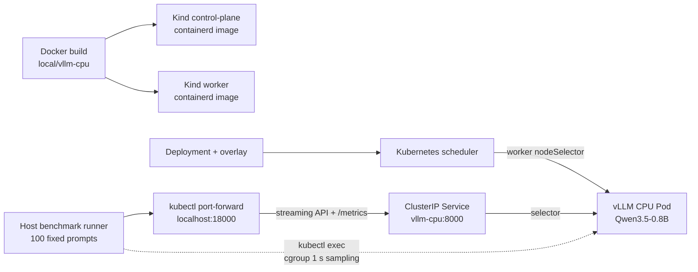
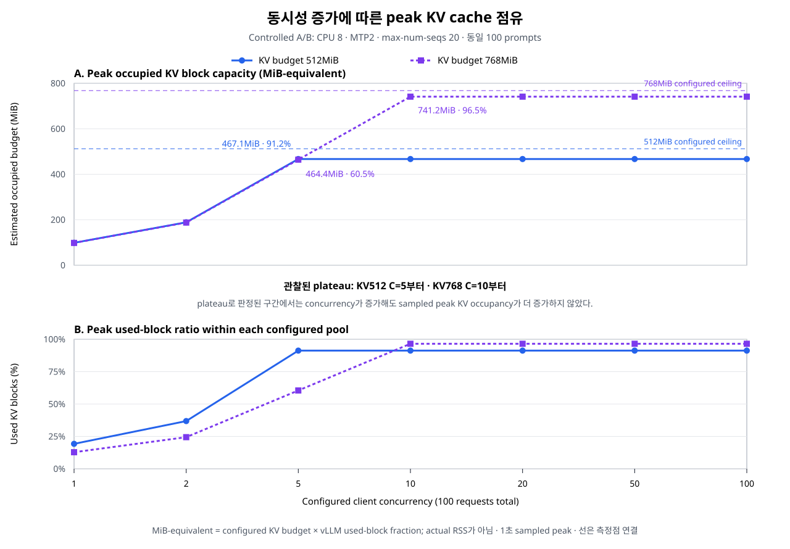
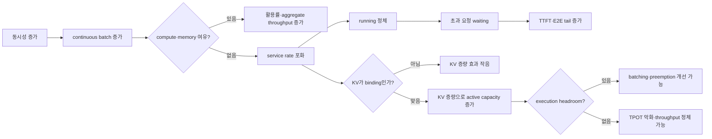
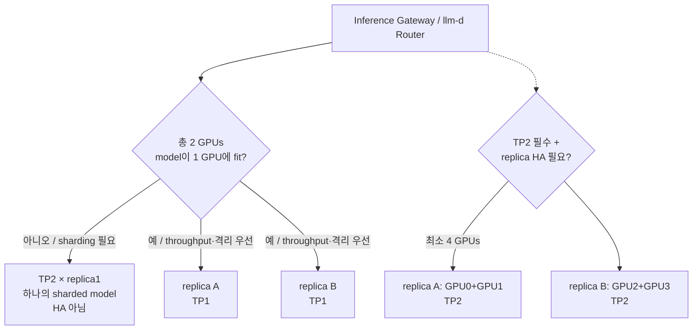

# 로컬 CPU Kubernetes 환경에서의 vLLM 추론 서빙 최적화

> CPU quota, MTP, KV cache 및 scheduler capacity의 통제 실험<br>
> 작성 기준: 2026-08-29 · 최종 제출용 보고서

이 문서는 과제 제출용 결론을 한 파일에서 읽을 수 있도록 구성한 최종본이다. [07 최종 종합 분석](results/07_FINAL_COMPREHENSIVE_ANALYSIS.md)은 수치와 감사 근거를 더 자세히 보존한 evidence compendium이고, [01~06 보고서](#9-재현성-과제-충족표와-산출물)는 단계별 작업 기록이다. 특히 [04 보고서](results/04_OPTIMIZATION_FINAL_ANALYSIS.md)의 CPU6 결합 설정 비교는 역사적 결과이며, 본문의 최종 인과 판단에는 이후 수행한 CPU8 단일 변수 실험을 사용한다.

## 초록

GPU나 클라우드 없이 개인 장비에서 대규모 언어 모델 서빙의 병목과 최적화 효과를 재현하기 위해 Apple M4 MacBook Air의 Docker Linux/ARM64 가상 환경에 CPU-only Kind Kubernetes 클러스터를 구성했다. 오픈웨이트 `Qwen/Qwen3.5-0.8B` BF16 모델을 `vLLM 0.26.0+cpu`로 서빙하고, 공개 데이터셋 네 종류에서 고정 추출한 100개 prompt를 동시성 `1, 2, 5, 10, 20, 50, 100`으로 각각 전송했다. 8개 정상 기동 설정에서 총 `5,600/5,600`건이 성공했고 client/server token counter가 모두 일치했다.

CPU limit `6→8` 증가는 모든 동시성에서 output throughput을 `11.7~24.8%` 높여 가장 일관된 개선이었다. MTP2는 CPU8 기준 C=1/2/5에서 `27.8/11.0/9.3%` 유리했지만 C=10/20에서 `3.5/9.9%` 불리했다. KV byte budget `512→768MiB`는 C≥10의 sampled peak running을 `5→8`로 늘렸으나 C=20 throughput은 `10.4%` 낮아졌다. `max-num-seqs 20→24`는 실제 running이 5에 머물러 상한이 작동하지 않았고, FP8 KV는 Apple ARM64 CPU kernel 미지원으로 API 기동 전에 실패했다. 따라서 지속적인 C≥10에는 `baseline-cpu8`을 선택하고, `mtp-cpu8`은 C≤5의 **low-concurrency throughput 후보**로 남겨 TTFT/E2E SLO 기준 반복 검증이 필요하다. 이 결과에서 GPU production으로 전이되는 것은 queueing·KV capacity의 원리와 통제 실험 방법이며, 수치와 최적 파라미터 자체는 아니다.

**키워드:** vLLM, CPU inference, Kubernetes, MTP, speculative decoding, KV cache, continuous batching, TTFT, TPOT

## 1. 연구 목적과 질문

### 1.1 목적

본 연구의 목표는 작은 CPU-only 환경에서 다음 과제 요구사항을 재현 가능하게 수행하는 것이다.

1. 모델 서빙 image를 정의하고 로컬 Kubernetes에 배포한다.
2. 길이와 형태가 다른 100개 prompt를 동일하게 유지한 채 동시 요청 수만 늘린다.
3. 사용자 latency, 처리량, scheduler·KV·Pod 자원을 함께 측정한다.
4. 최소 두 가지 최적화를 baseline과 같은 조건에서 재측정한다.
5. 효과가 없거나 실패한 변경도 원인과 증거를 보존한다.
6. 로컬 결과 중 GPU production에 유효한 원칙과 재설계할 부분을 구분한다.

이 실험은 모델의 정답률을 비교하는 평가가 아니다. 동일한 inference work를 주고 **서빙 시스템의 성능과 안정성**을 비교한다.

### 1.2 연구 질문과 검증 가설

| 연구 질문 | 직접 비교 | 고정한 변수 | 판정 질문 |
|---|---|---|---|
| RQ1. CPU quota | CPU6 baseline → CPU8 baseline | 모델, MTP off, KV 512MiB, max-seqs 20 | 추가 CPU가 모든 부하의 service rate를 높이는가 |
| RQ2. MTP | CPU8 baseline → CPU8 MTP2 | CPU8, KV 512MiB, max-seqs 20 | speculative decode의 순이득이 어느 동시성까지 유지되는가 |
| RQ3. KV capacity | CPU8 MTP2 KV512 → KV768 | CPU8, MTP2, max-seqs 20 | 더 많은 active request가 실제 처리량도 높이는가 |
| RQ4. Scheduler ceiling | CPU8 MTP2 seq20 → seq24 | CPU8, MTP2, KV 512MiB | 기존 `max-num-seqs=20`이 실제 병목인가 |
| RQ5. FP8 KV | BF16 KV → FP8 KV startup pilot | 동일 ARM64 CPU backend | 현재 hardware/runtime에서 기동 가능한가 |
| RQ6. GPU 전이 | CPU 관측 → 공식 GPU serving 원리 | 지표 정의와 queueing model | 무엇을 유지하고 무엇을 다시 측정해야 하는가 |

### 1.3 핵심 결론 한눈에 보기

| 변경 | 가장 중요한 관측 | 판정 |
|---|---|---|
| CPU `6→8` | 모든 C에서 output tok/s `+11.7~24.8%` | **채택:** 가장 일관된 local 개선. 단, vertical scaling임 |
| MTP2 | C1/2/5 output tok/s `+27.8/+11.0/+9.3%`, C10/20 `-3.5/-9.9%` | **조건부 채택:** C≤5 throughput 후보, C≥10 기본값 아님 |
| KV `512→768MiB` | C20 run/wait `5/15→8/12`, throughput `-10.4%` | **미채택:** capacity는 늘었지만 per-token speed는 개선하지 않음 |
| max-seqs `20→24` | peak run/wait 불변, C5~100 throughput `-0.4~-5.4%` | **미채택:** 기존 상한이 binding이 아님 |
| FP8 KV | API server 초기화 전 `NotImplementedError` | **호환성 실패:** 정식 성능 비교 대상이 아님 |


## 2. 시스템과 배포 구성

### 2.1 장비와 CPU-only 실행 증거

| 항목 | 실측·고정값 |
|---|---|
| Host | Apple M4 MacBook Air, logical CPU 10, unified memory 16GB |
| Docker Desktop VM | Linux/ARM64, 10 vCPU, 약 7.65GiB RAM |
| Docker / Kind / Kubernetes | Docker Engine 28.0.4 / Kind v0.32.0 / Kubernetes v1.32.11 |
| Cluster | `project-process`, control-plane 1 + worker 1 |
| Runtime | vLLM `0.26.0+cpu`, 시작 로그 `device_config=cpu` |
| GPU 사용 여부 | GPU·Metal·cloud 미사용, Pod에 GPU resource request 없음 |
| CPU cgroup | CPU8에서 `cpu.max=800000 100000`, 즉 최대 8 CPU cores |
| Service | namespace `llm-serving`, ClusterIP `vllm-cpu:8000` |

Docker VM의 메모리가 물리 메모리보다 작고 한 inference Pod가 최대 6GiB 이상을 사용하므로 control-plane 1개와 worker 1개, model replica 1개로 제한했다. 이는 과제의 컨테이너·Kubernetes 배포를 검증하기에는 충분하지만 HPA scale-out이나 worker 장애 후 다른 worker로의 재스케줄을 의미 있게 검증할 용량은 아니다.

### 2.2 모델과 런타임 선택 근거

최종 모델은 [`Qwen/Qwen3.5-0.8B`](https://huggingface.co/Qwen/Qwen3.5-0.8B), 고정 revision `2fc06364715b967f1860aea9cf38778875588b17`이다.

| 선택 기준 | 근거 |
|---|---|
| CPU 수용 가능성 | 0.8B, 약 1.63GiB BF16 checkpoint로 7.65GiB VM 안에 weight·runtime·KV를 함께 수용 가능 |
| 오픈웨이트 | Qwen 공식 repository, Apache-2.0 |
| 최적화 실험 | native MTP layer 1개가 있어 같은 target model에서 MTP off/on 비교 가능 |
| 재현성 | model revision과 base image digest를 고정하고 weight를 image에 포함 |
| 과제 workload | `--language-model-only`로 vision 경로를 비활성화한 text-only serving |

더 작은 Qwen2.5-0.5B는 CPU 부담은 낮지만 native MTP head가 없어 MTP 비교 목적과 맞지 않았다. 반대로 더 큰 모델은 7.65GiB VM에서 weight, KV cache, runtime allocator와 Kubernetes overhead를 안정적으로 함께 수용하기 어렵다. 따라서 Qwen3.5-0.8B는 **검토한 후보 중 장비 제약 안에서 MTP를 실제로 검증할 수 있는 최소 규모 모델**이었다.

컨테이너는 공식 ARM64 CPU image `vllm/vllm-openai-cpu:v0.26.0-arm64`를 digest `sha256:5966fcc14fe241ee7f2dc3d3fd5610ed12968eb9c0d096e1089802b79681efc4`로 고정했다. 모델은 image의 `/models/qwen3.5-0.8b`에 포함하고 Hugging Face/Transformers offline mode를 사용했다.

### 2.3 컨테이너와 Kubernetes 요청 흐름

`master`와 `worker`용 image를 따로 만드는 구조가 아니다. 같은 application image를 두 Kind node의 containerd에 로드하고, Kubernetes scheduler와 `nodeSelector`가 inference Pod를 worker에 배치한다.



주요 산출물은 [Dockerfile](../model_serving/Dockerfile), [Kind cluster 설정](../k8s/kind/cluster.yaml), [Kubernetes base](../model_serving/k8s/base/), [실험 overlay](../model_serving/k8s/overlays/), [1단계 배포 리포트](results/01_CONTAINER_CLUSTER_DEPLOYMENT.md)에 있다. 현재 복구 상태는 CPU8 MTP-off baseline이며 [final-state metadata](results/deployment/final-state-metadata.txt)에 image, args, CPU-only와 smoke 결과를 기록했다.

### 2.4 명시한 실행 파라미터

| 영역 | 값 | 선택 이유 |
|---|---|---|
| Model dtype | BF16 | checkpoint 정밀도 유지와 메모리 수용의 균형 |
| KV dtype | 정상 설정은 `auto`, 결과적으로 BF16 | FP8과 분리된 baseline 유지 |
| `max-model-len` | 2,048 | 모든 고정 input + output을 수용하면서 KV/RAM 제한 |
| `max-num-batched-tokens` | 2,048 | iteration의 token budget을 전 실험에서 고정 |
| `max-num-seqs` | baseline 20 | iteration당 sequence 상한; 24는 독립 실험 |
| `kv-cache-memory-bytes` | baseline 536,870,912(512MiB) | Pod memory headroom을 남긴 명시적 budget |
| Prefix caching | `--no-enable-prefix-caching` | 반복 phase·공통 system prompt의 cross-request warm-cache 편향 제거 |
| MTP | off 또는 `method=qwen3_next_mtp, num_speculative_tokens=2` | 같은 checkpoint의 native proposer 사용 |
| Pod CPU | request 4, limit 6 또는 8 cores | CPU quota의 직접 비교 |
| Pod memory | request 4Gi, limit 6656Mi | Docker VM 안에서 기동·부하 안정성 확보 |
| Replica / rollout | 1 / `Recreate` | 제한된 local memory에서 중복 Pod 방지 |
| API | streaming `/v1/chat/completions` | TTFT와 완료 시간을 client에서 분리 측정 |

일반 autoregressive KV cache는 요청 내부의 과거 K/V 재계산을 피하는 필수 상태이므로 끄지 않았다. 비활성화한 것은 **요청 간 prefix block 재사용**인 Automatic Prefix Caching(APC)뿐이다. 따라서 “KV cache를 비워 공정하게 측정했다”가 아니라, “동일 request-local KV는 유지하고 cross-request cache hit만 제거했다”가 정확하다.

OpenMP thread 수와 affinity, compilation 경로, chunked prefill과 block size는 고정 vLLM version의 기본값을 사용했다. CPU8 Pod에서는 visible CPU 10개 기준 inference thread 9개와 reserved core 1개가 관찰됐으므로, 후속 thread/affinity 실험 전에는 이 항목을 최적화 원인으로 단정하지 않는다.

## 3. 실험 방법

### 3.1 공개 데이터셋과 100개 workload

정답률이 아니라 길이와 형태가 다른 inference request를 만들기 위해 공식 공개 데이터셋 네 종류에서 각각 25건을 선택했다.

| Source | 원본 pool | 선택 | workload 특성 | 고정 revision |
|---|---:|---:|---|---|
| GSM8K test | 1,319 | 25 | 짧은~중간 수학 추론 | `3101c7d50724…` |
| HumanEval | 164 | 25 | 중간 길이 코드 완성 | `6d43fb980f9f…` |
| TruthfulQA | 790 | 25 | 짧은 사실 질의 | `d71c110897f5…` |
| LongBench Qasper | 200 | 25 | 긴 문맥 문서 QA | `5e628be450b7…` |

고정 seed `20260828`에 source별 offset `0/1000/2000/3000`을 더해 비복원 `random.sample`로 선택하고, 네 source를 한 건씩 interleave했다. 생성 코드와 전체 revision·원본 hash는 [prepare_dataset.py](../benchmark/scripts/prepare_dataset.py)와 [source-manifest.json](../benchmark/data/source-manifest.json)에 있다.

| Source | Input token min / mean / max | Token 합 | 전체 input 비중 |
|---|---:|---:|---:|
| TruthfulQA | 105 / 112.96 / 156 | 2,824 | 9.48% |
| GSM8K | 121 / 162.64 / 227 | 4,066 | 13.65% |
| HumanEval | 158 / 214.68 / 303 | 5,367 | 18.02% |
| Qasper | 422 / 701.36 / 1,049 | 17,534 | 58.86% |
| 전체 | 105 / 297.91 / 1,049 | 29,791 | 100% |

요청 수는 source별로 같지만 Qasper가 input token의 58.86%를 차지한다. 전체 input의 71%가 256 tokens 이하이고 최대값도 1,049이므로, 이 workload는 형태·길이 다양성은 제공하지만 2,048 context 경계의 극단적인 장문 서비스는 대표하지 않는다.

- `prompts.jsonl` SHA-256: `ce76ecbeb5810392ff94473c13ed98f54d56e3c32c9343bb187ef63f0db2bebc`
- prompt 순서 결합 workload SHA-256: `576df81caa41863089adbbe111e083a540291c18fe8f313e9867041f01f3b2aa`
- 개별 prompt SHA-256: 100개 모두 고유

### 3.2 동시성의 정확한 의미

각 단계는 **동일한 100건을 한 번씩** 처리한다. 동시성 C는 100건을 C번 반복한다는 뜻이 아니라, client가 최대 C건을 동시에 in-flight로 유지한다는 뜻이다.

```text
C=1    : 100건을 최대 1건씩 순차 처리
C=20   : 최대 20건 in-flight; 하나가 끝나면 다음 요청 제출
C=100  : 고정 100건 전체가 거의 동시에 in-flight

설정당 정식 요청 = 100 prompts × 7 concurrency phases = 700건
전체 정식 요청   = 8 variants × 700 = 5,600건
```

`ThreadPoolExecutor(max_workers=C)`를 사용한 closed-loop 부하이므로 완료된 자리에 다음 요청이 들어간다. 각 phase의 input/output work는 `29,791/6,400 tokens`로 같다. 요청당 output은 `64 tokens`, `ignore_eos=true`, `temperature=0`, seed `20260828`로 고정했다. phase별 warmup 3건은 8 output tokens만 생성하고 통계에서 제외했다.

이 설계는 before/after의 작업량을 맞추는 데 유리하지만, 고정 arrival rate나 Poisson traffic을 재현하는 open-loop 부하는 아니다.

### 3.3 실험 행렬

| 결과 ID | CPU limit | MTP | KV budget | max-seqs | 역할 |
|---|---:|---|---:|---:|---|
| `baseline` | 6 | off | 512MiB | 20 | 최초 CPU6 baseline |
| `mtp` | 6 | MTP2 | 512MiB | 20 | 역사적 CPU6 MTP-only |
| `mtp-kv-tuned` | 6 | MTP2 | 768MiB | 24 | 역사적 legacy capacity bundle |
| `baseline-cpu8` | 8 | off | 512MiB | 20 | CPU limit 단일 변경 |
| `mtp-cpu8` | 8 | MTP2 | 512MiB | 20 | CPU8 MTP-only |
| `mtp-kv768-cpu8` | 8 | MTP2 | 768MiB | 20 | KV budget 단일 변경 |
| `mtp-seq24-cpu8` | 8 | MTP2 | 512MiB | 24 | max-seqs 단일 변경 |
| `mtp-kv-tuned-cpu8` | 8 | MTP2 | 768MiB | 24 | legacy capacity bundle |

`mtp-kv-tuned*`는 artifact 이름을 보존한 것이며 실제로는 KV와 max-seqs를 동시에 바꾼 **결합 설정**이다. 이 설정과 baseline의 차이를 KV 또는 max-seqs의 단독 효과라고 해석하지 않는다. 본문의 인과 판단은 CPU6→CPU8, CPU8 baseline→MTP, MTP→KV-only, MTP→maxseq-only의 직접 비교를 사용한다. FP8은 API 기동 전에 실패한 별도 startup pilot이므로 5,600건 행렬에 포함하지 않는다.

### 3.4 측정 지표와 선택 이유

| 관점 | 지표 | 선택 이유 | 해석 시 주의 |
|---|---|---|---|
| 정확성 | success rate, client/server token 합 | 실패·불완전 stream을 빠른 요청으로 오인하지 않음 | server counter와 usage가 정상이어야 함 |
| 사용자 지연 | E2E p50/p95/p99 | 요청 시작부터 stream 종료까지 전체 체감 | client·port-forward overhead 포함 |
| 첫 응답 | TTFT p50/p95/p99 | queue와 prefill의 영향을 관찰 | queue와 prefill을 직접 분해하지 않음 |
| Decode | TPOT p50/p95/p99 | 첫 token 이후 생성 간격의 근사 | `(E2E-TTFT)/(tokens-1)`이며 실제 ITL 분포가 아님 |
| 처리량 | request/s, prompt/output token/s | 요청 길이와 완료 시간을 함께 반영 | closed-loop workload에 한정 |
| Scheduler | running, waiting, preemption | active width와 queue·재계산 관찰 | 1초 sampling이 짧은 peak를 놓칠 수 있음 |
| KV | usage, 기동 token capacity | cache pressure와 active capacity 연결 | 서로 다른 KV budget의 %를 그대로 비교하면 안 됨 |
| MTP | draft/accepted tokens, acceptance | proposal 유효 비율 확인 | acceptance만으로 verification 비용을 설명할 수 없음 |
| Pod | cgroup CPU, RAM, OOM/restart | container 전체 자원과 안정성 확인 | host thermal·memory bandwidth는 분리하지 못함 |

평균만 보면 느린 일부 요청이 숨겨지므로 latency는 percentile을 사용했다. 다만 E2E·TTFT·TPOT p95는 서로 다른 요청이 percentile 위치를 차지할 수 있어 서로 더하지 않는다. Peak running과 peak waiting도 서로 다른 시점의 독립 최댓값이므로 같은 순간의 상태처럼 합산하지 않는다.

### 3.5 데이터 유효성

- 정식 8개 설정에서 `5,600/5,600` 요청 성공, HTTP 실패 0
- 모든 phase에서 client prompt/completion token과 server counter 증가량 일치
- metric scrape error 0, OOM kill 0, prefix cache hit 0
- model endpoint, prompt hash, image ID, args와 resource를 run manifest에 보존
- host suspension으로 wall/monotonic timer가 벌어진 CPU6 C2와 CPU8 C10 초기 표본은 `excluded/`에 보존하고 같은 100건으로 재측정
- CPU8 C5의 두 유효 표본은 output throughput이 11.01과 13.16 tok/s로 19.5% 달라, 설정당 단일 실행의 변동이 작지 않음을 확인

따라서 큰 방향은 비교할 수 있지만 작은 차이를 일반적인 인과효과로 확정할 수는 없다.

## 4. 실험 결과

### 4.1 CPU6 baseline: 포화점과 queue 형성

| C | Output tok/s | E2E p95 | TTFT p95 | TPOT p95 | Peak run / wait¹ | Peak KV | 평균 CPU |
|---:|---:|---:|---:|---:|---:|---:|---:|
| 1 | 5.16 | 19.00s | 9.74s | 152.37ms | 1 / 0 | 7.5% | 5.99 |
| 2 | 7.64 | 22.32s | 11.93s | 319.15ms | 2 / 0 | 13.4% | 5.99 |
| 5 | 11.28 | 38.92s | 27.90s | 422.60ms | 5 / 0 | 32.8% | 5.55 |
| 10 | 12.06 | 66.80s | 43.46s | 753.07ms | 10 / 1 | 64.2% | 5.52 |
| 20 | 13.50 | 131.17s | 70.41s | 1,040.10ms | 16 / 11 | 100% | 5.46 |
| 50 | 13.46 | 254.46s | 204.58s | 1,038.46ms | 16 / 40 | 100% | 5.50 |
| 100 | 13.54 | 464.06s | 425.21s | 1,214.28ms | 16 / 91 | 100% | 5.54 |

¹ Running과 waiting은 1초 sampled 시계열에서 각각 구한 독립 최댓값이다.


첫 waiting은 C=10에서 관찰됐다. C=20에서는 KV 사용률이 100%가 되고 running이 16에서 더 늘지 않은 채 waiting이 11까지 증가했다. C=50과 C=100에서도 output throughput은 약 13.5 tok/s로 더 늘지 않았고 waiting만 40과 91로 커졌다. 평균 CPU는 모든 phase에서 6-core limit 부근이었다.

따라서 baseline의 주요 현상은 “동시성이 높아져 처리량이 계속 감소”한 것이 아니라 다음과 같다.

1. C=1→20에서는 batching으로 aggregate throughput이 5.16→13.50 tok/s까지 증가했다.
2. C=20 부근에서 CPU service rate와 KV active capacity가 포화됐다.
3. 이후 running은 정체되고 초과 요청이 waiting으로 이동했다.
4. C=20→100에서 처리량은 plateau인 반면 E2E p95는 131.17→464.06초로 증가했다.

Peak RAM은 최대 6.05GiB였고 OOM event는 없었으며 run 시작 시 restart count는 0이었다. 따라서 tail latency 악화는 memory crash가 아니라 **정상 기동 상태의 CPU·KV 포화와 queue 증가**로 설명하는 것이 적절하다.

### 4.2 전체 핵심 설정의 output throughput

다음 표는 CPU6 baseline과 네 가지 CPU8 직접 비교 설정의 output token/s다. 전체 8개 variant와 모든 percentile은 [자동 생성 전체 비교표](../benchmark/results/comparison-all/REPORT.md)에 보존한다.

| C | CPU6 baseline | CPU8 baseline | CPU8 MTP2 | MTP2 + KV768 | MTP2 + seq24 |
|---:|---:|---:|---:|---:|---:|
| 1 | 5.16 | 6.44 | 8.24 | 8.13 | 8.97 |
| 2 | 7.64 | 9.28 | 10.30 | 10.63 | 12.04 |
| 5 | 11.28 | 13.16 | 14.38 | 12.39 | 14.30 |
| 10 | 12.06 | 14.94 | 14.41 | 12.95 | 14.36 |
| 20 | 13.50 | 16.22 | 14.62 | 13.10 | 14.40 |
| 50 | 13.46 | 15.03 | 14.89 | 14.35 | 14.46 |
| 100 | 13.54 | 15.15 | 15.18 | 14.85 | 14.35 |

열 머리글이 공유하는 baseline은 서로 다르다. CPU quota 효과는 CPU6→CPU8 baseline, MTP 효과는 CPU8 baseline→MTP2, KV와 max-seqs 효과는 CPU8 MTP2→각 단일 변경으로 판단한다.

### 4.3 RQ1: CPU limit 6→8

모델, MTP off, KV 512MiB, max-seqs 20과 workload를 고정하고 Pod CPU limit만 6에서 8로 바꿨다.

| C | Output tok/s 6→8 | 변화 | E2E p95 변화 | TTFT p95 변화 | TPOT p95 변화 |
|---:|---:|---:|---:|---:|---:|
| 1 | 5.16→6.44 | +24.8% | -17.8% | -16.2% | -20.6% |
| 2 | 7.64→9.28 | +21.4% | -16.9% | -19.4% | -22.4% |
| 5 | 11.28→13.16 | +16.7% | -11.8% | -8.0% | -16.0% |
| 10 | 12.06→14.94 | +23.9% | -19.3% | -21.6% | -19.3% |
| 20 | 13.50→16.22 | +20.2% | -16.2% | -22.6% | -0.9% |
| 50 | 13.46→15.03 | +11.7% | -9.6% | -11.7% | -3.3% |
| 100 | 13.54→15.15 | +11.8% | -10.4% | -8.8% | -17.5% |

Phase 평균 CPU는 CPU6 전체 평균 5.65 cores에서 CPU8 7.11 cores로 증가했다. 즉 추가 quota가 실제 inference work에 사용됐고, 모든 동시성의 output throughput과 세 latency 지표가 같은 방향으로 개선됐다. CPU8에서도 C≥20의 peak running 16과 KV 100%는 그대로였으므로 queue 병목을 없앤 것은 아니지만 service rate 자체는 높였다.

이는 이번 장비에서 가장 명확한 단일 변경이다. 다만 소프트웨어 알고리즘이 같은 상태에서 더 많은 core time을 할당한 **vertical scaling**이므로, 비용·전력까지 포함한 효율 최적화와는 구분한다.

### 4.4 RQ2: CPU8 baseline 대비 MTP2

정식 MTP 설정은 다음과 같다.

```text
--speculative-config '{"method":"qwen3_next_mtp","num_speculative_tokens":2}'
```

`qwen3_next_mtp`는 실험 당시 vLLM 0.26에서 사용한 alias이며 내부적으로 MTP 방식으로 정규화된다. 다음 재실험에서는 현재 문서 표기인 `method=mtp`와 token depth 1·2를 명시적으로 비교하는 것이 좋다.

| C | Output tok/s 변화 | E2E p95 변화 | TTFT p95 변화 | TPOT p95 변화 | Peak run/wait 변화 | Acceptance |
|---:|---:|---:|---:|---:|---:|---:|
| 1 | 6.44→8.24 (+27.8%) | -14.5% | +9.1% | -24.4% | 1/0→1/0 | 76.7% |
| 2 | 9.28→10.30 (+11.0%) | -0.6% | +2.6% | +3.8% | 2/0→2/0 | 76.2% |
| 5 | 13.16→14.38 (+9.3%) | -11.9% | -63.6% | -0.5% | 5/0→5/0 | 75.2% |
| 10 | 14.94→14.41 (-3.5%) | -2.2% | -8.2% | -31.8% | 10/1→5/5 | 75.6% |
| 20 | 16.22→14.62 (-9.9%) | -15.0% | +41.6% | -62.5% | 16/9→5/15 | 75.8% |
| 50 | 15.03→14.89 (-0.9%) | -4.7% | +11.3% | -62.7% | 16/41→5/45 | 76.7% |
| 100 | 15.15→15.18 (+0.2%) | -0.1% | +0.9% | -59.5% | 16/91→5/95 | 76.5% |

낮은 동시성에서는 accepted proposal이 target model의 순차 decode step 일부를 대체해 순이득을 낼 수 있다. 실제로 C=1/2/5의 output throughput이 개선됐다. 그러나 C≥10에서는 MTP 설정의 기동 KV token capacity가 baseline 19,894에서 9,137로 줄고 sampled peak running이 5에 머물렀다. proposal·verification 작업과 더 작은 active width가 함께 작용하는 조건에서 throughput 이득은 사라졌다.

C=20은 지표를 하나만 보면 잘못 판단하기 쉬운 사례다.

| C=20 | CPU8 baseline | CPU8 MTP2 | 해석 |
|---|---:|---:|---|
| Output throughput | 16.22 | 14.62 tok/s | 100건 전체 완료 속도는 9.9% 악화 |
| E2E p95 | 109.94 | 93.47s | p95 요청의 전체 시간은 개선 |
| TTFT p95 | 54.48 | 77.13s | first-token 전 queue/prefill 구간 악화 |
| TPOT p95 | 1,030.33 | 386.05ms | first-token 이후 active decode 근사는 개선 |
| Peak running / waiting | 16 / 9 | 5 / 15 | 더 적게 active, 더 많이 waiting |

MTP에서 TPOT가 크게 낮아졌어도 active request 수와 queue 조건이 baseline과 다르다. 적은 수의 sequence가 decode를 공유하면 각 active request의 TPOT는 낮아질 수 있지만, 더 많은 요청이 first token 전에 기다려 aggregate completion rate는 떨어질 수 있다. 또한 세 p95는 서로 다른 요청일 수 있으므로 `E2E p95 = TTFT p95 + 63×TPOT p95`처럼 계산하지 않는다.

따라서 “MTP가 C=20에서 모든 latency를 개선했다”도, “MTP가 항상 느리다”도 맞지 않는다. **낮은 동시성의 후보이고, 높은 동시성에서는 queue·throughput trade-off가 나타났다**가 실측에 맞는 결론이다.

### 4.5 RQ3: KV byte budget 512→768MiB

CPU8, MTP2, max-seqs 20을 고정하고 KV byte budget만 늘렸다.



위 그래프의 MiB-equivalent는 `configured KV budget × sampled used-block fraction`으로 계산한 block-capacity 추정치이며 실제 Pod RSS가 아니다. KV512는 C=5부터 약 467MiB, KV768은 C=10부터 약 741MiB에서 plateau했다. 설정별 percentage의 분모가 다르므로 “91%보다 96%가 5%p만 더 썼다”처럼 해석하지 않고 절대 budget과 함께 본다.

| 지표 | C=10, KV512→768 | C=20, KV512→768 | 판정 |
|---|---:|---:|---|
| Peak running / waiting | 5/5→8/2 | 5/15→8/12 | active capacity 개선 |
| Budget-equivalent KV | 467.1→741.2MiB | 467.1→741.2MiB | 추가 block 공간을 실제 사용 |
| Output throughput | 14.41→12.95 (-10.2%) | 14.62→13.10 (-10.4%) | 완료 속도 악화 |
| TTFT p95 | 31.30→22.14s (-29.3%) | 77.13→73.09s (-5.2%) | queue 이동으로 일부 개선 |
| TPOT p95 | 414.52→740.37ms (+78.6%) | 386.05→745.59ms (+93.1%) | active decode 경쟁 악화 |
| E2E p95 | 52.75→60.17s (+14.1%) | 93.47→114.02s (+22.0%) | 최종 사용자 latency 악화 |

KV 증량 뒤 1초 sampled peak 기준으로 running 최대값은 3 늘고 waiting 최대값은 3 줄었다. 두 peak는 서로 다른 시점일 수 있으므로 동일한 세 요청이 즉시 이동했다고 해석하지 않는다. KV memory는 context를 더 **수용**하는 자원이지 model forward를 직접 **가속**하는 연산 자원이 아니다. 같은 8-core quota에서 더 많은 active sequence가 CPU execution, cache와 memory bandwidth를 공유한 관측과 일치한다. 정확한 비중은 profiler 없이 분리하지 못했으므로 CPU cache 또는 memory bandwidth가 단독 원인이라고 단정하지 않는다.

C=1/2/5에서는 active capacity가 달라지지 않았다. 이 구간의 작은 증감과 C=5의 -13.8%는 KV가 작동한 효과보다 설정당 단일 실행 변동의 경고로 분류한다.

### 4.6 RQ4: max-num-seqs 20→24

CPU8, MTP2, KV512를 고정하고 `max-num-seqs`만 20에서 24로 늘렸다.

| C | Output tok/s seq20→24 | 변화 | Peak run/wait | Peak KV |
|---:|---:|---:|---:|---:|
| 1 | 8.24→8.97 | +8.9% | 1/0→1/0 | 19.3→19.3% |
| 2 | 10.30→12.04 | +16.8% | 2/0→2/0 | 36.8→36.8% |
| 5 | 14.38→14.30 | -0.6% | 5/0→5/0 | 91.2→91.2% |
| 10 | 14.41→14.36 | -0.4% | 5/5→5/5 | 91.2→91.2% |
| 20 | 14.62→14.40 | -1.5% | 5/15→5/15 | 91.2→91.2% |
| 50 | 14.89→14.46 | -2.9% | 5/45→5/45 | 91.2→93.0% |
| 100 | 15.18→14.35 | -5.4% | 5/95→5/95 | 91.2→91.2% |

실제 sampled peak running은 모든 phase에서 기준과 같고 최대 5였다. 기존 상한 20에 도달하지 않았으므로 상한 24는 scheduler 결정을 바꿀 수 없었다. 따라서 C=1/2의 +8.9/+16.8%도 max-seqs의 효과라는 기전이 없고 실행 간 변동으로 보는 것이 타당하다.

`max-num-seqs=50`은 이번 최종 설정에 넣지 않았다. 먼저 KV와 다른 scheduler budget을 조정해 실제 running이 20에 도달하는 조건을 만든 뒤 `8/12/16/20/24/50`을 sweep해야 “20이라는 상한이 병목”이라는 가설을 검증할 수 있다. 현 상태에서 50만 실행하면 non-binding parameter와 run variance를 비교하게 된다.

### 4.7 효과가 없거나 실패한 후보

#### FP8 KV: startup compatibility failure

Baseline이 C≥20에서 KV 100%에 도달했기 때문에 같은 byte budget에 더 많은 token을 저장하려고 다음 overlay를 실제 배포했다.

```text
--kv-cache-dtype fp8 --calculate-kv-scales
```

Pod는 worker에 배치됐지만 API server 초기화 전에 exit code 1과 BackOff가 발생했다.

```text
NotImplementedError: FP8 KV cache on CPU requires x86 with AVX-512 or AMX.
```

Apple M4는 Linux/aarch64이며 vLLM 0.26 CPU backend에 필요한 FP8 KV kernel이 없다. 또한 hybrid GDN layer의 runtime scale 계산이 비활성화돼 default scale 1.0을 사용한다는 경고가 있었다. API가 Ready가 되지 않은 설정에 700건을 보내면 FP8 성능이 아니라 connection failure를 측정하므로 정식 행렬에 포함하지 않았다. Baseline으로 복구해 Ready 1/1을 확인했다.

이는 FP8 KV가 일반적으로 무효라는 뜻이 아니다. 지원 x86 CPU 또는 CUDA/ROCm GPU에서 capacity, latency와 model quality를 다시 검증해야 한다. 당시 console 내용을 [실패 리포트](results/03_FAILED_OPTIMIZATION_FP8_KV.md)에 옮겼지만 원시 `kubectl logs/describe/events` 파일을 보존하지 못한 provenance 한계도 함께 기록한다.

#### Generic MTP 5 tokens: 기동하지만 후보 탈락

초기 제안인 `{"method":"mtp","num_speculative_tokens":5}`도 CPU6·동일 20-prompt pilot에서 확인했다. 모델의 native MTP layer는 1개뿐이므로 같은 layer를 반복 사용했고, C=20 acceptance와 output throughput은 48.41%, 9.01 tok/s였다. 동일 CPU6·20-prompt MTP2 pilot은 66.73%, 11.13 tok/s로 MTP5보다 throughput이 23.5% 높았다. 이 직접 비교를 근거로 MTP5는 700건 정식 후보에서 제외하고 MTP2를 선택했다. 이후 CPU8·100-prompt formal MTP2의 75~77% acceptance는 별도 실험 결과이며 pilot 선택 근거와 섞지 않는다. Speculative depth는 클수록 항상 좋은 값이 아니며 native MTP layer 수와 acceptance·verification cost를 함께 봐야 한다.

### 4.8 자원과 안정성

| Variant | 성공 | Preemption | Peak RAM | OOM / OOM-kill | Prefix hit |
|---|---:|---:|---:|---:|---:|
| CPU6 baseline | 700/700 | 2 | 6.05GiB | 0 / 0 | 0 |
| CPU8 baseline | 700/700 | 2 | 6.15GiB | 0 / 0 | 0 |
| CPU8 MTP2 | 700/700 | 0 | 6.10GiB | 0 / 0 | 0 |
| CPU8 MTP2 KV768 | 700/700 | 0 | 6.31GiB | 0 / 0 | 0 |
| CPU8 MTP2 seq24 | 700/700 | 0 | 6.12GiB | 0 / 0 | 0 |

전체 8개 정식 설정도 `5,600/5,600`건이 완료됐고 scrape error와 OOM kill은 0이었다. KV768은 6.5GiB limit까지 약 0.19GiB만 남겨 local run은 완주했지만 production allocator 변동, sidecar, 더 긴 context나 rolling replica를 수용할 headroom은 아니다. Run manifest의 restart count는 실행 시작 snapshot이므로 phase 전체의 연속 계측 증거는 아니라는 제한이 있다.

## 5. 논의

### 5.1 동시성이 증가할 때의 병목 모델

vLLM continuous batching은 C>1부터 여러 요청을 함께 처리한다. C=20이 batching의 시작점인 것이 아니라, 이번 설정에서 **hardware service rate와 active-context capacity의 포화가 뚜렷해진 지점**이다.



[vLLM 최적화 가이드](https://docs.vllm.ai/en/v0.26.0/configuration/optimization/)도 KV 부족 시 preemption과 recompute가 E2E를 악화할 수 있으며, KV를 늘리거나 `max_num_seqs`·`max_num_batched_tokens`를 낮추는 선택에는 capacity와 latency trade-off가 있다고 설명한다. 이번 실험은 preemption이 많지는 않았지만 KV plateau, running 정체와 waiting 증가를 함께 관찰했다.

### 5.2 처음 가정과 실제 판정

| 처음 가정 | 성립하려면 필요한 조건 | 이번 결과 |
|---|---|---|
| MTP면 모든 구간이 빨라진다 | accepted token으로 절약한 target step이 proposal·verification·capacity 비용보다 커야 함 | C≤5 output throughput은 유리, C10/20 throughput은 불리; latency는 지표별 상이 |
| KV를 늘리면 모든 구간이 빨라진다 | KV가 실제 병목이고 늘어난 active batch를 처리할 execution headroom도 있어야 함 | running은 5→8, C20 throughput은 -10.4% |
| max-seqs를 늘리면 동시 처리가 늘어난다 | 실제 running이 기존 상한에 도달해야 함 | running 최대 5라 seq20/24가 동일하게 동작 |
| GPU도 CPU와 같은 수치가 나온다 | hardware 병목과 kernel·batch shape가 같아야 함 | queueing 원리만 같고 최적값·증감 방향은 재측정 필요 |

MTP는 “한 번에 여러 token을 맞히는 기능”이지만 공짜가 아니다. draft token을 생성하고 target model로 검증하며 rejected token은 다시 생성해야 한다. 낮은 동시성에는 줄인 순차 step이 중요하지만, 높은 동시성에는 target model 자체가 이미 batch parallelism을 활용하므로 추가 proposal·verification과 KV/scheduler 비용이 상대적으로 커질 수 있다. 이 비용 구조는 [Speculative Decoding 원 논문](https://proceedings.mlr.press/v202/leviathan23a.html)과 일치하지만, 이번 실험은 profiler를 수집하지 않아 각 component의 시간을 직접 분해하지는 못했다.

KV cache도 연산을 대신하는 accelerator가 아니다. 요청 내부에서 이전 token의 K/V를 재계산하지 않도록 상태를 보존하고, APC가 켜진 경우에만 요청 간 동일 prefix의 prefill도 재사용한다. KV byte budget을 늘리면 resident context와 active sequence의 상한은 높아질 수 있지만 model FLOPs나 memory-bandwidth cost 자체가 줄지는 않는다.

### 5.3 CPU와 GPU에서 같은 것, 달라지는 것

**같은 원리:** active token·request가 늘면 KV 점유가 커지고, compute·KV·scheduler budget 중 하나가 포화되면 running은 정체하며 초과 요청은 waiting 또는 preemption으로 이동한다. 그러므로 GPU에서도 output tok/s만 보지 않고 TTFT·TPOT/ITL·running·waiting·KV usage·preemption을 함께 봐야 한다.

**달라지는 결과:** GPU의 prefill은 주로 compute-bound이고 decode는 HBM memory-bandwidth와 kernel/batch shape의 영향을 크게 받는다. CPU보다 큰 batch를 효율적으로 처리할 수 있어 KV 증량 후 throughput이 개선될 수도 있다. 반대로 compute/HBM이 이미 포화된 상태에서 active sequence만 늘리면 이번 CPU 실험처럼 per-request latency가 악화될 수 있다. 따라서 “GPU에서도 KV를 늘리면 동일하게 느려진다”도, “GPU에서는 반드시 빨라진다”도 증명되지 않는다.

### 5.4 로컬 최종 설정

| traffic 특성 | 권장 설정 | 근거 | 주의 |
|---|---|---|---|
| 지속적인 C≥10 | `baseline-cpu8` | 높은 부하에서 가장 안정적인 aggregate throughput | C≥20 queue는 남으므로 admission control 필요 |
| C≤5 low-concurrency throughput | `mtp-cpu8` 후보 | C1/2/5 aggregate throughput 개선 | TTFT/E2E SLO별로 최소 3회 반복 후 채택 |
| active capacity 우선 | KV768은 실험 후보, 기본값은 보류 | sampled peak running 5→8 | 같은 CPU에서 throughput·TPOT 악화 |
| scheduler ceiling | `max-num-seqs=20` 유지 | 실제 running이 20에 도달하지 않음 | binding 조건을 만든 뒤 sweep |
| benchmark cache 정책 | APC off 유지 | cross-request prefix reuse를 끈 비교 공정성 | production cache 성능을 의미하지 않음 |

CPU8은 Docker VM의 10 vCPU 중 8만 inference Pod에 허용해 control-plane, kubelet, container runtime과 benchmark client의 여유를 남긴 값이다. “가능한 유일한 최적화”가 아니라, 이번에 검증한 단일 변경 중 가장 일관된 값이다.

## 6. 대규모 GPU Kubernetes production 전환

### 6.1 유지할 원칙과 다시 설계할 부분

| 영역 | 그대로 유효한 것 | GPU production에서 다시 설계할 것 |
|---|---|---|
| 재현성 | model revision, image digest, workload/config hash 고정 | CUDA/ROCm·driver·GPU generation별 image matrix |
| 실험 | 한 번에 한 변수, 동일 prompt/token work, 실패 결과 보존 | production trace, open-loop arrival, 3회 이상 반복과 비용/SLO Pareto |
| 지표 | E2E·TTFT·TPOT·throughput + run/wait/KV/preemption | GPU utilization, HBM bandwidth, power, NCCL와 per-rank 상태 추가 |
| 배포 | probe, Service, resource 선언, rollback | GPU operator/device plugin, taint, topology, MIG, model weight cache |
| 가용성 | controller가 Pod 상태를 복구하는 원리 | multi-replica/AZ, RollingUpdate, PDB, topology spread, drain/failure test |
| scaling | 부하와 자원 동시 관찰 | queue/TTFT/KV 기반 custom autoscaling, 긴 model load time 반영 |
| 보안 | namespace와 내부 Service 분리 | Gateway, TLS/auth, rate limit, quota, NetworkPolicy |

Kubernetes [topology spread constraints](https://kubernetes.io/docs/concepts/scheduling-eviction/topology-spread-constraints/)는 replica를 node/zone failure domain에 분산하는 수단이고, [PDB](https://kubernetes.io/docs/concepts/workloads/pods/disruptions/)는 drain 같은 **voluntary disruption** 중 동시 중단 수를 제한한다. PDB가 hardware failure를 막는 것은 아니므로 replica와 topology가 먼저 필요하다.

### 6.2 TP2와 replica2: 검증된 조건부 선택

사용자의 “KV를 많이 쓰는 요청에는 TP2, 단순 요청에는 replica2”라는 가정은 방향성은 있지만, 요청의 복잡도만으로 선택하면 부족하다. [vLLM parallelism 문서](https://docs.vllm.ai/en/v0.26.0/serving/parallelism_scaling/)와 [data parallel 배포 문서](https://docs.vllm.ai/en/v0.26.0/serving/data_parallel_deployment/)에 따르면 판단 기준은 **model fit, single-replica KV headroom, aggregate throughput, interconnect와 가용성**이다.

| 총 GPU 2개일 때 | `TP=2, replica=1` | `TP=1, replica=2` |
|---|---|---|
| 구조 | 두 GPU에 parameter를 sharding한 하나의 논리 replica | 전체 model을 가진 독립 replica 두 개 |
| 우선 검토 조건 | 모델이 한 GPU에 안 들어감; weight sharding으로 KV 여유가 필요함; single-request latency 개선 가능성을 시험함 | 모델이 한 GPU에 들어감; 독립 요청의 aggregate throughput·fault isolation이 중요함 |
| KV 관점 | per-GPU weight 점유를 줄여 KV 여유가 생길 수 있음 | 각 replica가 별도 KV cache를 가짐; prefix locality가 분산될 수 있음 |
| 비용 | rank 간 collective·동기화와 topology 의존 | model weight를 두 번 적재, routing 필요 |
| 장애 | 한 rank/GPU가 사라지면 그 replica 전체가 불완전 | 다른 node에 분산했을 때 한 replica 장애를 다른 replica가 수용 가능 |
| 결론 | **병렬화이지 HA가 아님** | model이 fit하면 throughput·가용성의 출발점 |

`--kv-cache-memory-bytes`는 [GPU별 설정](https://docs.vllm.ai/en/v0.26.0/configuration/engine_args/)이다. TP2가 weight memory를 줄여 KV 공간을 만들 수는 있지만 “논리 KV capacity가 정확히 2배”라고 계산하면 안 된다. KV-head 구조, dtype, TP에서의 shard/replication, max model length와 runtime overhead에 따라 달라지므로 시작 로그의 `GPU KV cache size`와 `Maximum concurrency`, runtime preemption을 직접 비교해야 한다.



TP2가 필수인 모델에서 replica 수준 이중화까지 원하면 최소 `2 replicas × TP2 = 4 GPUs`가 필요하다. TP rank는 NVLink/NVSwitch 등 빠른 interconnect가 있는 같은 node에 두고, replica들은 node/zone failure domain에 분산하는 구성이 일반적인 출발점이다. 모델이 한 GPU에 들어간다면 먼저 replica2를 측정하고, TP2는 single-request latency나 KV/preemption 개선이 통신 비용을 상쇄하는지 같은 총 GPU 수로 A/B 비교한다.

### 6.3 Round-robin 대신 llm-d Router를 쓸 조건

llm-d의 최신 구성 요소 명칭은 **llm-d Router**이며 내부 Endpoint Picker(EPP)가 endpoint를 선택한다. 공식 [scheduling 문서](https://llm-d.ai/docs/0.8/architecture/core/router/epp/scheduling)는 prefix match뿐 아니라 KV utilization, queue depth, running requests와 token load를 scorer로 사용할 수 있다고 설명한다.

| routing 방식 | 장점 | 한계와 적용 조건 |
|---|---|---|
| Round-robin | 단순하고 overhead가 작음 | request 길이·queue·KV locality를 보지 않아 hotspot 또는 cache miss 가능 |
| Load-aware | queue, running, KV pressure가 낮은 endpoint 선택 | metric freshness와 scoring calibration 필요 |
| Prefix-cache-aware | 해당 prefix KV가 있는 replica로 보내 중복 prefill 감소 | vLLM APC와 반복 prefix가 전제; hot prefix 집중을 load scorer로 완화해야 함 |
| Precise prefix-aware | KVEvents로 실제 block→Pod index 유지 | tokenizer/model/block 설정 일치와 추가 indexer overhead 필요 |

llm-d는 여러 Pod의 KV cache를 자동으로 하나로 합치는 기능이 아니다. **해당 prefix가 남아 있는 Pod를 찾아 요청을 보내는 locality routing**이다. vLLM [Automatic Prefix Caching](https://docs.vllm.ai/en/v0.26.0/features/automatic_prefix_caching/)도 shared prefix의 prefill을 줄일 뿐 decode token 생성은 가속하지 않는다.

이번 workload의 100개 **user prompt**는 모두 고유하지만 모든 요청은 같은 system prompt prefix를 공유한다. APC를 꺼서 이 공통 prefix까지 포함한 cross-request reuse를 의도적으로 비활성화했으므로 prefix-aware routing의 효과를 검증하지 않았다. 실제 서비스에 공통 system prompt, 동일 문서에 대한 여러 질문, multi-turn session이 많다면 round-robin과 llm-d EPP를 cold/warm으로 나눠 비교할 가치가 있다. 반복 prefix가 적은 서비스에서도 load-aware routing은 queue imbalance를 줄일 수 있지만 별도 실측이 필요하다.

### 6.4 장문 서비스의 max-seqs 설계

`max-num-seqs`는 client concurrency도 KV byte budget도 아니다. 한 scheduler iteration에 처리할 sequence 수의 상한이다. `max-num-batched-tokens`는 같은 iteration의 token budget이다. 장문 request는 한 sequence가 많은 KV block과 prefill token을 사용하므로 두 값을 공동 튜닝해야 한다.

| 파라미터 | 직접 바꾸는 것 | 너무 높을 때 | 너무 낮을 때 |
|---|---|---|---|
| `max-model-len` | 허용 context 상한 | KV sizing·memory reservation 증가 가능 | 실제 장문 request 거부 |
| `max-num-seqs` | iteration active sequence 상한 | KV resident set·preemption·per-request 경쟁 증가 | GPU batch 활용 저하, waiting 증가 |
| `max-num-batched-tokens` | iteration token budget | 큰 prefill이 decode ITL을 방해할 수 있음 | prefill이 여러 chunk로 나뉘어 TTFT/throughput 저하 가능 |
| KV bytes / dtype | resident block capacity | 다른 memory headroom 감소 | preemption·running 제한 |

[vLLM optimization 문서](https://docs.vllm.ai/en/v0.26.0/configuration/optimization/)는 chunked prefill에서 작은 `max_num_batched_tokens`가 ITL에, 큰 값이 TTFT와 throughput에 유리할 수 있다고 설명한다. 이는 방향성이지 모든 GPU·모델의 보편 최적값이 아니다. Chunked prefill을 끄는 경우에는 `max_num_batched_tokens >= max_model_len` 제약도 확인해야 한다.

장문 production 실험은 다음 순서가 적절하다.

1. 실제 input/output length(ISL/OSL) 분포와 SLO에 맞춰 `max-model-len`을 명시적으로 고정한다.
2. Chunked prefill on/off를 명시하고, 이를 비교한다면 각 상태를 별도 outer A/B factor로 둔다.
3. 시작 로그의 maximum concurrency와 runtime KV/preemption을 확인한다.
4. 같은 `max-model-len`·chunked-prefill 상태에서 `max-num-seqs = 8/12/16/20/24/50`과 `max-num-batched-tokens = 2048/4096/8192+`를 2차원 sweep한다.
5. TTFT·ITL/TPOT p95/p99, output tok/s, queue time, preemption과 KV usage를 함께 본다.
6. throughput 하나가 아니라 SLO를 만족하는 Pareto 지점을 선택한다.

장문 문서 QA처럼 prefill이 decode를 지속적으로 방해한다는 증거가 있으면 [llm-d prefill/decode disaggregation](https://llm-d.ai/docs/0.8/architecture/advanced/disaggregation)을 검토할 수 있다. Prefill pool과 decode pool을 독립 scaling할 수 있지만 KV transfer 비용과 network/RDMA 요구가 생기므로 항상 더 빠른 구성이 아니며, 짧은 prompt 중심 서비스에는 aggregated replicas가 더 단순할 수 있다.

### 6.5 Autoscaling과 고가용성

CPU 사용률 HPA는 이 과제의 선택 항목으로는 가능하지만 GPU inference production의 주된 수요 지표로는 부족하다. GPU가 포화돼도 frontend CPU 사용률은 낮을 수 있고, 큰 model의 load가 길면 queue가 생긴 뒤 scale-out하는 반응형 정책이 늦다.

[Kubernetes HPA](https://kubernetes.io/docs/concepts/workloads/autoscaling/horizontal-pod-autoscale/)는 custom/external metric을 지원하므로 다음을 조합하는 편이 낫다.

- waiting requests 또는 queue time
- TTFT SLO 위반률
- in-flight tokens와 arrival rate
- KV usage와 preemption
- ready replica 수와 model load/startup 시간

Scale-out만으로 prefix locality가 깨질 수 있으므로 llm-d Router의 load/prefix scoring, warm weight cache와 readiness를 함께 설계한다. Replica들은 topology spread/anti-affinity로 분산하고 RollingUpdate, startup/readiness probe, PDB, node drain·강제 장애 시험을 별도로 수행한다.

## 7. 타당성 위협과 후속 연구

### 7.1 분석 한계

1. **반복 측정이 부족하다.** 대부분의 설정을 한 번만 측정했고 실험 순서도 같았다. CPU8 C5 재측정값도 19.5% 차이가 났으므로 작은 차이는 확정적 개선으로 보지 않는다.
2. **실제 서비스 트래픽과 다르다.** 영어 공개 데이터 100건, 최대 입력 1,049 tokens, 고정 출력 64 tokens를 사용했다. 따라서 초장문·한국어 요청과 답변 품질 변화는 확인하지 못했다.
3. **로컬 환경만 검증했다.** 로컬 클라이언트와 `port-forward`를 사용했고 자원을 1초 간격으로 수집했다. 실제 네트워크와 순간적인 자원 상승은 반영하지 못했고, 단일 worker라 HPA와 장애 복구도 실험하지 못했다.
4. **결과를 다른 환경에 그대로 적용할 수 없다.** 이 결론은 Apple M4·Qwen3.5-0.8B·vLLM 0.26 CPU 조합에 한정된다. GPU나 다른 모델에서는 최적 설정을 다시 측정해야 한다.

### 7.2 다음으로 할 실험

1. **결과 신뢰도 높이기:** 핵심 설정을 무작위 순서로 3회 이상 반복하고 중앙값과 변동 폭을 확인한다.
2. **CPU 최적화 추가 비교:** CPU 스레드 수, MTP1·MTP2, ARM에서 지원하는 가중치 압축을 한 번에 하나씩 바꿔 속도와 품질을 확인한다.
3. **장문 요청 최적화:** 실제 장문 데이터로 `max-num-seqs`, `max-num-batched-tokens`, chunked prefill을 함께 조절하고 대기 시간·생성 속도·KV 사용량을 비교한다.
4. **GPU 운영 구성 검증:** 같은 GPU 2개로 TP2 서버 1개와 독립 replica 2개를 비교한다. 공통 prefix가 많은 요청에서 APC와 llm-d의 KV-aware routing 효과도 확인한다.

## 8. 결론

CPU-only local Kubernetes에서 vLLM model serving, 100개 고정 workload, 7단계 동시성과 8개 설정을 재현했고 `5,600/5,600`건을 정상 완료했다. 가장 일관된 개선은 CPU quota `6→8`이었으며, MTP2는 C≤5의 aggregate throughput 후보였지만 TTFT/E2E SLO별 반복 검증이 필요했다. KV `512→768MiB`는 active capacity를 늘렸으나 같은 CPU 실행 용량에서 throughput을 높이지 못했고, `max-num-seqs 20→24`는 기존 상한이 binding이 아니어서 효과가 없었다. FP8 KV는 Apple ARM64 CPU backend의 kernel 미지원으로 성능 측정 전 기동 실패했다.

최종 local 기본값은 **CPU8, MTP off, KV 512MiB, max-num-seqs 20**이다. GPU production에서도 concurrency→capacity 포화→queue 증가라는 원리와 다중 지표 검증 방법은 유지되지만 MTP, KV, batch와 parallelism의 최적값은 GPU별로 다시 측정해야 한다. 모델이 한 GPU에 들어가면 replica2를 throughput·가용성의 출발점으로 삼고, model fit 또는 single-replica KV headroom이 부족할 때 TP2를 검토한다. TP2 자체는 이중화가 아니며, shared prefix가 많은 다중 replica 서비스에는 round-robin보다 llm-d Router의 load/prefix-aware scheduling을 별도 검증하는 것이 다음 단계다.

## 9. 재현성, 과제 충족표와 산출물

### 9.1 과제 요구사항 충족

| 과제 요구 | 구현·증거 |
|---|---|
| 런타임 model serving image 정의·빌드 | [Dockerfile](../model_serving/Dockerfile), [model serving README](../model_serving/README.md), [build metadata](results/deployment/build-metadata.txt) |
| Local Kubernetes cluster 생성·image load | [k8s README](../k8s/README.md), [Kind config](../k8s/kind/cluster.yaml), [cluster metadata](results/deployment/cluster-metadata.txt) |
| K8s resource 작성·배포 | [base/overlays](../model_serving/k8s/), [1단계 리포트](results/01_CONTAINER_CLUSTER_DEPLOYMENT.md) |
| 100건 × 동시성 1/2/5/10/20/50/100 | [benchmark README](../benchmark/README.md), [runner](../benchmark/scripts/run_benchmark.py), [원시 결과](../benchmark/results/) |
| 단계별 성능 지표 기록 | [baseline 결과](../benchmark/results/baseline/REPORT.md), [전체 비교](../benchmark/results/comparison-all/REPORT.md) |
| 두 가지 이상 최적화·재측정 | CPU quota, MTP, KV-only, maxseq-only와 legacy bundle 총 8개 설정 |
| 실패 최적화 분석 | [FP8 KV 실패 기록](results/03_FAILED_OPTIMIZATION_FP8_KV.md), MTP5 pilot 분석 |
| 최종 before/after 분석 | 본 보고서와 [상세 evidence compendium](results/07_FINAL_COMPREHENSIVE_ANALYSIS.md) |
| 선택: worker failure / HPA | 장비 memory와 단일 worker 제약으로 미수행; production 설계만 제시 |

### 9.2 주요 재현 명령

```bash
# Image, 2-node Kind, image load, CPU8 baseline deploy
make image
make cluster
make load
make verify-cluster
make deploy-baseline-cpu8
make smoke

# CPU6 / CPU8 baseline
make deploy
make benchmark-baseline
make deploy-baseline-cpu8
make benchmark-baseline-cpu8

# CPU8 단일 변수 실험
make deploy-mtp-cpu8
make benchmark-mtp-cpu8
make deploy-mtp-kv768-cpu8
make benchmark-mtp-kv768-cpu8
make deploy-mtp-seq24-cpu8
make benchmark-mtp-seq24-cpu8

# 보존된 8개 결과 재검증·표·SVG 재생성
make benchmark-compare-all
make validate-docs
```

긴 benchmark를 다시 실행할 때 제출 원본을 덮어쓰지 않으려면 `RESULTS_ROOT="$(mktemp -d /tmp/k8s-llm-results.XXXXXX)"`를 각 target에 넘긴다.

### 9.3 핵심 산출물

- 전체 자동 비교: [`benchmark/results/comparison-all`](../benchmark/results/comparison-all/)
- CPU6 baseline 원본: [`benchmark/results/baseline`](../benchmark/results/baseline/)
- CPU8 baseline 원본: [`benchmark/results/baseline-cpu8`](../benchmark/results/baseline-cpu8/)
- CPU8 MTP2 원본: [`benchmark/results/mtp-cpu8`](../benchmark/results/mtp-cpu8/)
- CPU8 KV-only 원본: [`benchmark/results/mtp-kv768-cpu8`](../benchmark/results/mtp-kv768-cpu8/)
- CPU8 maxseq-only 원본: [`benchmark/results/mtp-seq24-cpu8`](../benchmark/results/mtp-seq24-cpu8/)
- 실험 인과 행렬: [`optimization/EXPERIMENT_MATRIX.md`](../optimization/EXPERIMENT_MATRIX.md)
- 단계별 리포트: [01 배포](results/01_CONTAINER_CLUSTER_DEPLOYMENT.md), [02 baseline](results/02_BASELINE_BENCHMARK.md), [03 FP8 실패](results/03_FAILED_OPTIMIZATION_FP8_KV.md), [04 CPU6 역사 분석](results/04_OPTIMIZATION_FINAL_ANALYSIS.md), [05 CPU6→8](results/05_BASELINE_CPU8_ANALYSIS.md), [06 CPU8 MTP/bundle](results/06_CPU8_MTP_KV_ANALYSIS.md), [07 상세 종합](results/07_FINAL_COMPREHENSIVE_ANALYSIS.md)

## 참고문헌과 공식 근거

1. [Qwen3.5-0.8B 공식 model card](https://huggingface.co/Qwen/Qwen3.5-0.8B) 및 [고정 checkpoint](https://huggingface.co/Qwen/Qwen3.5-0.8B/commit/2fc06364715b967f1860aea9cf38778875588b17)
2. [vLLM 0.26 CPU 설치·튜닝](https://docs.vllm.ai/en/v0.26.0/getting_started/installation/cpu/) 및 [serve CLI](https://docs.vllm.ai/en/v0.26.0/cli/serve/)
3. [vLLM MTP](https://docs.vllm.ai/en/v0.26.0/features/speculative_decoding/mtp/) 및 [Automatic Prefix Caching](https://docs.vllm.ai/en/v0.26.0/features/automatic_prefix_caching/)
4. [vLLM Optimization and Tuning](https://docs.vllm.ai/en/v0.26.0/configuration/optimization/) 및 [Engine Arguments](https://docs.vllm.ai/en/v0.26.0/configuration/engine_args/)
5. [vLLM Parallelism and Scaling](https://docs.vllm.ai/en/v0.26.0/serving/parallelism_scaling/) 및 [Data Parallel Deployment](https://docs.vllm.ai/en/v0.26.0/serving/data_parallel_deployment/)
6. [vLLM Quantized KV Cache](https://docs.vllm.ai/en/v0.26.0/features/quantization/quantized_kvcache/) 및 [Production Metrics](https://docs.vllm.ai/en/stable/design/metrics/)
7. Yaniv Leviathan et al., [Fast Inference from Transformers via Speculative Decoding](https://proceedings.mlr.press/v202/leviathan23a.html), ICML 2023.
8. Woosuk Kwon et al., [Efficient Memory Management for Large Language Model Serving with PagedAttention](https://arxiv.org/abs/2309.06180), SOSP 2023.
9. [llm-d Router scheduling](https://llm-d.ai/docs/0.8/architecture/core/router/epp/scheduling), [Prefix Cache Aware Routing](https://llm-d.ai/docs/0.8/architecture/advanced/kv-management/prefix-cache-aware-routing), [Disaggregation](https://llm-d.ai/docs/0.8/architecture/advanced/disaggregation)
10. Kubernetes [Horizontal Pod Autoscaling](https://kubernetes.io/docs/concepts/workloads/autoscaling/horizontal-pod-autoscale/), [Topology Spread Constraints](https://kubernetes.io/docs/concepts/scheduling-eviction/topology-spread-constraints/), [Disruptions and PDB](https://kubernetes.io/docs/concepts/workloads/pods/disruptions/)
