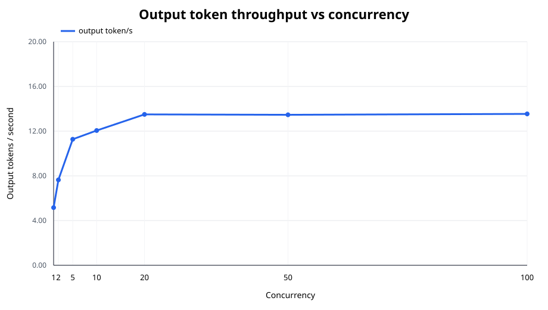
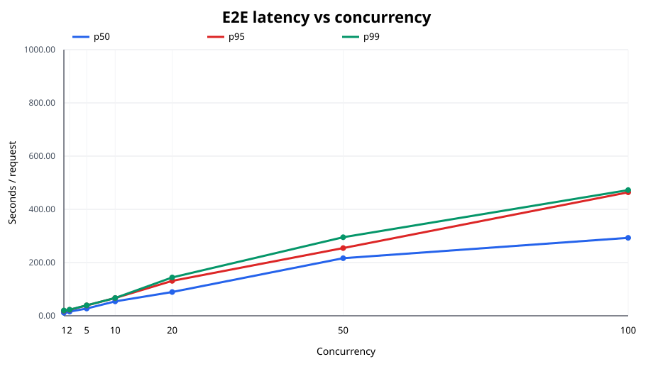
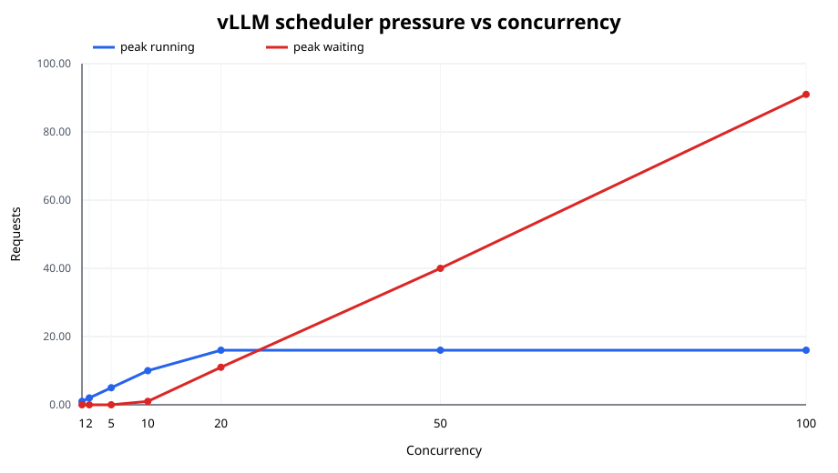
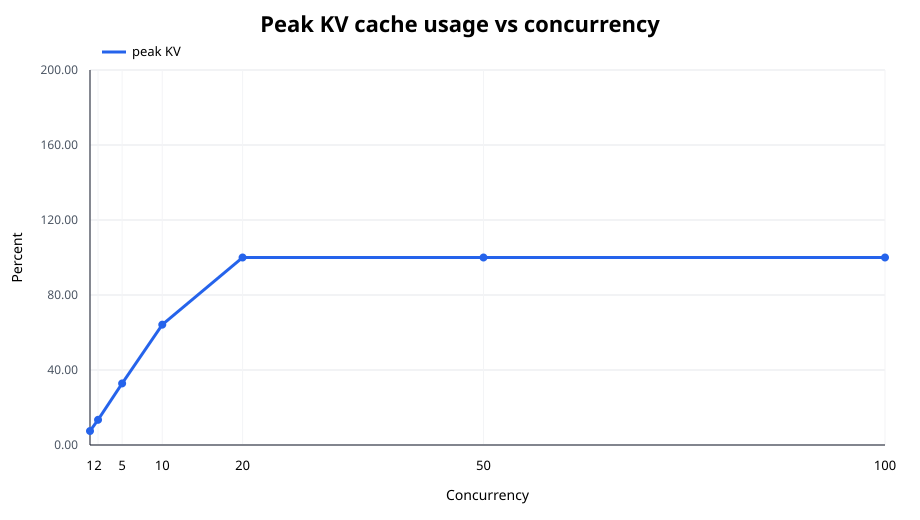

# 2. 100-request 베이스라인 부하 측정 및 분석

## 범위와 완료 상태

배포된 `vllm-cpu` Service에 공개 벤치마크 기반 프롬프트 100건을 동시성 `1, 2, 5, 10, 20, 50, 100`으로 각각 전송했다. 각 단계의 요청 수는 100건이므로 정식 측정은 총 700건이며, 전부 정상 완료됐다. 이 단계에서는 MTP 등 최적화를 켜지 않고 CPU vLLM 베이스라인만 측정했다.

동시성 20은 요청 100건을 20번 반복한다는 뜻이 아니다. 고정된 100건 중 최대 20건이 동시에 in-flight가 되도록 worker 20개가 closed-loop로 처리하고, 하나가 끝나면 다음 요청을 제출한다. 따라서 각 단계는 입력 데이터와 총 작업량이 같고 동시 요청 수만 다르다.

## 워크로드 선정과 재현성

정답률이 아니라 서로 다른 길이와 형태의 추론 요청을 제공하는 용도로 다음 공식 공개 데이터셋에서 고정 시드 `20260828`로 25건씩 선택했다.

| 소스 | 건수 | 특성 | 고정 revision |
|---|---:|---|---|
| [GSM8K](https://github.com/openai/grade-school-math) | 25 | 짧은~중간 수학 추론 | `3101c7d...` |
| [HumanEval](https://github.com/openai/human-eval) | 25 | 중간 길이 코드 완성 | `6d43fb9...` |
| [TruthfulQA](https://github.com/sylinrl/TruthfulQA) | 25 | 짧은 사실 질의 | `d71c110...` |
| [LongBench](https://github.com/THUDM/LongBench) Qasper | 25 | 긴 문맥 QA | `5e628be...` |

원본 URL·revision·파일 SHA-256은 [`source-manifest.json`](../../benchmark/data/source-manifest.json), 실제 100개 요청은 [`prompts.jsonl`](../../benchmark/data/prompts.jsonl)에 기록했다. workload 선택 결과 SHA-256은 `576df81caa418630...`, 실제 측정 입력 파일 SHA-256은 `ce76ecbeb5810392...`다. 서버가 계산한 입력 길이는 최소 105, 평균 297.9, 최대 1,049 tokens였다. HumanEval의 생성 코드는 실행하지 않았고 LongBench 문맥은 2,048-token 모델 한도 안으로 결정적으로 잘랐다.

## 통제 조건

- 모델/런타임: `Qwen/Qwen3.5-0.8B`, vLLM `0.26.0+cpu`, BF16
- API: streaming `/v1/chat/completions`
- 출력: 요청당 64 tokens, `ignore_eos=true`
- 샘플링: `temperature=0`, seed `20260828`
- 단계별 warmup 3건은 통계에서 제외
- Pod: CPU request/limit 4/6 cores, memory request/limit 4Gi/6.5Gi
- vLLM: context 2,048, `max-num-seqs=20`, KV cache 512MiB
- Automatic Prefix Caching: `--no-enable-prefix-caching`

요청 내부 KV cache는 autoregressive decoding에 필요한 상태라 유지했다. 요청 간 동일 prefix를 재사용하는 APC만 껐고, 모든 단계에서 prefix cache hit counter 증가량이 0인지 확인했다. 출력도 매번 정확히 64 tokens로 고정해 조기 EOS에 따른 작업량 차이를 제거했다.

## 지표 선정 근거

| 영역 | 지표 | 선택 이유 |
|---|---|---|
| 정확성 | success rate, client/server token 합계 | 실패나 불완전 스트림을 빠른 요청으로 잘못 집계하지 않기 위해 |
| 사용자 지연 | E2E p50/p95/p99 | 전체 대기 시간과 tail latency 확인 |
| 첫 응답 | TTFT p50/p95/p99 | prefill과 scheduler queue 영향을 분리 |
| 디코딩 | TPOT p50/p95/p99 | 첫 token 이후 생성 속도 비교 |
| 처리량 | request/s, prompt/output token/s | 요청 길이를 고려해 시스템 용량 비교 |
| vLLM 내부 | running, waiting, KV usage, preemption | 처리량 포화와 queue/KV 원인 확인 |
| 컨테이너 | cgroup CPU cores, memory, OOM events | API 프로세스가 아닌 Pod 전체 자원과 장애 확인 |

평균만 보면 일부 매우 느린 요청이 숨겨지므로 latency는 percentile을 사용했다. 최적화의 decode 효과는 output token/s와 TPOT를 우선 보고, TTFT·waiting을 함께 봐서 단순 queue 이동을 개선으로 오판하지 않도록 했다.

## 실행 절차

```bash
make verify-cluster
make status
make smoke
make benchmark-data
make benchmark-baseline
```

실행기는 Service port-forward를 생성하고, 단계별 warmup 후 100건을 보낸다. 동시에 vLLM `/metrics`와 Pod cgroup을 1초마다 수집한다. macOS에서는 `caffeinate -dimsu`를 자동 사용해 sleep으로 client timer와 Docker VM이 함께 멈추는 것을 방지한다. 집계와 SVG는 원시 파일에서 다음 명령으로 다시 만들 수 있다.

```bash
make benchmark-analyze
```

구체적인 스크립트 옵션과 파일 구조는 [`benchmark/README.md`](../../benchmark/README.md)에 기록했다.

## 실측 결과

| C | 성공률 | req/s | output tok/s | E2E p50 / p95 (s) | TTFT p50 / p95 (s) | TPOT p50 / p95 (ms) | peak running / waiting | peak KV | avg CPU | peak RAM |
|---:|---:|---:|---:|---:|---:|---:|---:|---:|---:|---:|
| 1 | 100% | 0.081 | 5.16 | 11.31 / 19.00 | 2.22 / 9.74 | 143.56 / 152.37 | 1 / 0 | 7.5% | 5.99 | 5.71GiB |
| 2 | 100% | 0.119 | 7.64 | 15.63 / 22.32 | 3.66 / 11.93 | 163.86 / 319.15 | 2 / 0 | 13.4% | 5.99 | 6.05GiB |
| 5 | 100% | 0.176 | 11.28 | 27.29 / 38.92 | 15.27 / 27.90 | 179.08 / 422.60 | 5 / 0 | 32.8% | 5.55 | 5.76GiB |
| 10 | 100% | 0.188 | 12.06 | 54.16 / 66.80 | 25.39 / 43.46 | 412.73 / 753.07 | 10 / 1 | 64.2% | 5.52 | 5.82GiB |
| 20 | 100% | 0.211 | 13.50 | 89.30 / 131.17 | 35.70 / 70.41 | 857.63 / 1,040.10 | 16 / 11 | 100% | 5.46 | 5.83GiB |
| 50 | 100% | 0.210 | 13.46 | 216.41 / 254.46 | 168.19 / 204.58 | 818.13 / 1,038.46 | 16 / 40 | 100% | 5.50 | 5.83GiB |
| 100 | 100% | 0.212 | 13.54 | 292.90 / 464.06 | 228.07 / 425.21 | 765.29 / 1,214.28 | 16 / 91 | 100% | 5.54 | 5.85GiB |

서버 prompt/generation token counter 증가량은 모든 단계에서 각각 `29,791/6,400`이고 클라이언트 usage 합계와 정확히 일치했다. 전체 preemption은 2회, prefix hit는 0회, OOM kill과 Pod restart는 0회였다. 전체 수치와 p99는 [`summary.csv`](../../benchmark/results/baseline/summary.csv), 실행 환경과 해시는 [`run-manifest.json`](../../benchmark/results/baseline/run-manifest.json)에서 확인할 수 있다.

초기 C=2 표본에는 host 중단으로 UTC wall clock과 monotonic timer 사이 5,365.15초의 차이가 있어 원시 데이터를 [`excluded/`](../../benchmark/results/baseline/excluded/)에 보존하고 같은 100건으로 재측정했다. 위 표는 중단 없이 완료돼 두 timer의 차이가 0.05초 미만인 재측정값이다.

### 처리량과 지연시간





C=1에서 C=20으로 늘리면 output throughput은 `5.16 → 13.50 token/s`, 즉 2.62배로 증가했다. nominal 최고치는 C=100의 13.54 token/s지만 C=20보다 0.33% 높을 뿐이다. 반면 C=20에서 C=100으로 갈 때 E2E p95는 `131.17 → 464.06초`, 3.54배가 됐다. 따라서 이 장비의 실용적 처리량 포화점은 C=20이며 더 높은 동시성은 처리량보다 queue latency만 키웠다.

### 원인: CPU·KV·scheduler queue





첫 waiting은 C=10에서 관찰됐다. C=20에서는 KV가 100%가 되고 peak running이 설정값 20보다 낮은 16에 머문 반면 waiting은 11까지 늘었다. C=50과 C=100에서도 running은 16으로 고정되고 waiting만 40과 91로 늘었다. 평균 CPU도 모든 단계에서 6-core limit 부근인 5.46~5.99 cores였다. 즉 고정 CPU 계산 용량과 512MiB KV가 active decode 수를 제한하고, 초과 부하는 scheduler queue로 이동했다.

C=50/100의 TPOT p50이 C=20보다 조금 낮아진 사실만 보고 고동시성이 개선됐다고 판단하면 안 된다. 초과 요청은 first token 전에 기다리므로 대기 비용이 TPOT보다 TTFT에 집중된다. 실제로 C=100 TTFT p95는 425.21초이고 E2E p95도 크게 악화됐다.

Peak memory는 최대 6.05GiB로 6.5GiB limit 안에서 안정됐고 OOM/restart가 없었다. 그러므로 이 tail latency 악화는 메모리 장애가 아니라 CPU 포화, KV 포화, scheduler queue의 결과다.

## 객관성의 한계

각 설정을 한 번 실행했으므로 OS background load와 thermal state의 영향을 완전히 제거하지 못했다. 또한 이 워크로드는 모델 정답률이 아니라 서빙 성능 측정용이며, closed-loop 결과를 실제 사용자의 open-loop arrival rate와 동일시할 수 없다. 최적화 전후 최종 결론에서는 각 설정을 3회 이상 교차 실행해 중앙값과 변동 폭을 제시하는 것이 바람직하다.

## 다음 최적화 비교 계획

첫 번째 최적화는 동일 Qwen3.5-0.8B에 Qwen 공식 recipe의 `{"method":"qwen3_next_mtp","num_speculative_tokens":2}`를 적용하고 `draft/accepted tokens`와 acceptance rate까지 측정하는 것이다. 두 번째는 KV cache 예산과 `max-num-seqs`를 함께 조정해 C=20 이후 active running 16 제한을 완화하되, memory/OOM과 latency trade-off를 비교하는 것이다. 두 경우 모두 이 베이스라인의 동일 100 prompts, 64 output tokens, 동시성 7단계를 그대로 사용한다.

MTP는 중·저 QPS의 memory-bound decode에 유리할 가능성이 있지만 CPU verification overhead와 높은 동시성에서는 효과가 없거나 악화될 수 있다. 따라서 성공 기준을 단순 E2E 하나가 아니라 output token/s, TPOT, TTFT, acceptance rate, CPU 사용량의 조합으로 판단한다.

분석 스크립트가 자동 생성한 전체 리포트와 11개 그래프는 [`benchmark/results/baseline/REPORT.md`](../../benchmark/results/baseline/REPORT.md)에 있다.
